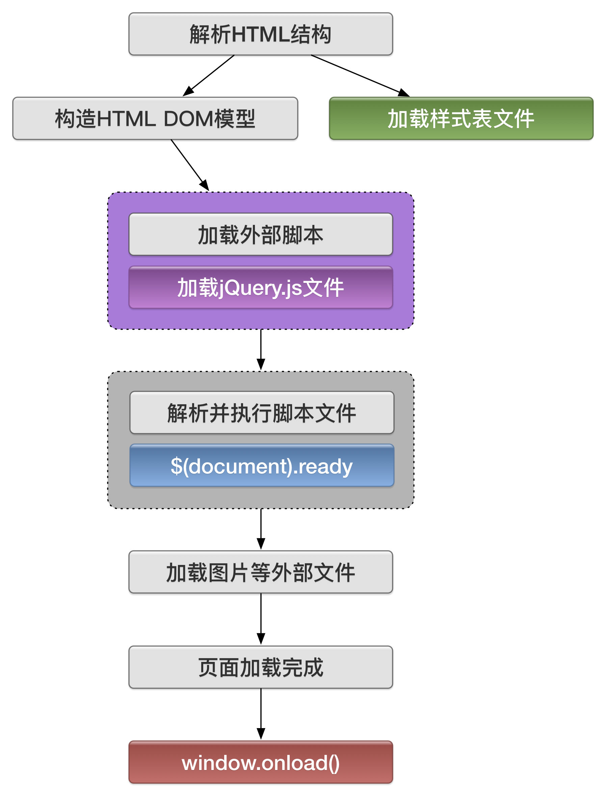

% 核心课程
% jQuery 入门基础课
% jQuery 介绍, 选择器和事件处理


## 认识jQuery
`jQuery`封装了`JavaScript`常用的功能代码, 提供一种简洁, 快捷的`JavaScript`设计模式, 优化了`HTML`文档操作, 事件处理, 动画设计和`Ajax`交互. 可以说`jQuery`改变了用户编写`JavaScript`代码的方式. `jQuery`设计的宗旨是`"Write Less, Do More"`, 写更少的代码, 做更多的事情.

`jQuery`项目主要包括`jQuery Core`(核心库), `jQuery UI`(界面库), `Sizzle`(CSS选择器)和`Qunit`(测试套件)四部分, 现在又增加了一个新的部分就是 `jQuery Mobile`(手机端).

`John Resig`是团队的主要核心人物之一, `jQuery`是`John Resig`于2006年1月开发的一个开源项目.

* [jQuery官方网站](http://jquery.com)
* [jQuery项目组官方网站](https://jquery.org/)
* [John Resig个人网站:](http://ejohn.org/)

### jQuery能做什么
`jQuery`库为`Web`脚本编程提供了通用的抽象层,使得它几乎适用于任何脚本编程的情形。由于它容易扩展而且不断有新插件面世增强它的功能,所以一本书根本无法涵盖它所有可能的用途和功能。抛开这些不谈,仅就其核心特性而言,`jQuery`能够满足下列需求。

#### 1. 取得文档中的元素
如果不使用`JavaScript`库,遍历`DOM`(`Document Object Model`,文档对象模型)树,以及查找HTML文档结构中某个特殊的部分,必须编写很多行代码。`jQuery`为准确地获取需要检查或操纵的文档元素,提供了可靠而富有效率的选择符机制。

```javascript
 $('div.content').find('p');
```

#### 2. 修改页面的外观
`CSS`虽然为影响文档呈现的方式提供了一种强大的手段,但当所有浏览器不完全支持相同的标准时,单纯使用`CSS`就会显得力不从心。`jQuery`可以弥补这一不足, 它提供了跨浏览器的标准解决方案。而且,即使在页面已经呈现之后,`jQuery`仍然能够改 变文档中某个部分的类或者个别的样式属性。

通过引入`jQuery`, 程序开发人员可以很便捷地控制页面的`CSS`文件. 浏览器对页面文件的兼容性, 一直以来都是页面开发者最为头痛的事, 而使用`jQuery`操作页面的样式却可以很好地兼容各种浏览器.

```javascript
 $('ul > li:first').addClass('active');
```

#### 3. 对页面事件的处理
`jQuery`能够影响的范围并不局限于简单的外观变化,使用少量的代码, `jQuery`就能改变文档的内容。可以改变文本、插入或翻转图像、列表重新排序,甚至对 `HTML`文档的整个结构都能重写和扩充——所有这些只需一个简单易用的API。

```javascript
 $('#container').append('<a href="more.html">more</a>');
```

引入`jQuery`库后, 可以使页面的表现层与功能开发分离, 开发者更多地专注于程序的逻辑与功效; 页面设计者侧重于页面的优化与用户体验. 然后, 通过事件绑定机制, 可能很轻松地实现二者的结合.

即使是最强大和最精心设计的行为,如果我们无法控制它何时发生,那它也毫无用处。`jQuery`提供了截获形形色色的页面事件(比如用户单击某个链接)的适当方式,而不需要使用事件处理程序拆散`HTML`代码。此外,它的事件处理`API`也消除了经常困扰Web开发人员浏览器的不一致性。


```javascript
 $('button.show-details').click(function() {
   $('div.details').show();
 });
```

#### 4. 大量插件在页面中的运用
在引入`jQuery`库后, 还可以使用大量的插件来完善页面的功能和效果, 如表单插件, UI插件, 这些插件的使用极大的丰富了页面的展示效果, 使原来`JavaScript`代码遥不可及的功能通过插件的引入而软件轻松的实现.

#### 5. 与Ajax技术的完美结合
`Ajax`的异步读取服务器数据的方法, 极大地方便了程序的开发, 加深了用户的页面体验度: 而引入`jQuery`库后, 不仅完善了三原有的功能, 而且减少了代码的书写, 通过其内部对象或函数, 加上几行代码就可以实现复杂的功能.

无需刷新页面从服务器获取信息。这种编程模式就是众所周知的`Ajax`(`Asynchronous JavaScript and XML,异步JavaScript和XML`),它是一系列在客户端和服务器之间传输数据的强大技术。`jQuery`通过消除这一过程中的浏览器特定的复杂性,使开发人员得以专注于服务器端的功能设计,从而得以创建出反应灵敏、功能丰富的网站。

```javascript
 $('div.details').load('more.html #content');
```

#### 6. 为页面添加动态效果
为了实现某种交互式行为,设计者也必须向用户提供视觉上的反馈。`jQuery`中内置的一批淡入、擦除之类的效果,以及制作新效果的工具包,为此提供了便利。

```javascript
 $('div.details').slideDown();
```

#### 7. 简化常见的JavaScript任务
除了这些完全针对文档的特性之外,`jQuery`也改进了对基本 的`JavaScript`数据结构的操作(例如迭代和数组操作等)。

```javascript
$.each(obj, function(key, value) {
  total += value;
});
```


## 使用jQuery开发环境

### 教学中使用版本
如果是别的开发库或是应用软件, 这个问题很容易回答。因为一般来说,最合适的版本就是最新版本。可是,对于现在的`jQuery` 3.1.0版来说,问题就复杂一点了。为了确保在现代浏览器中速度更快, 代码更简洁,`jQuery`从2.0版开始不再支持IE6、IE7和IE8。

但`jQuery`开发团队知道,支持这些老版本浏览器也很重要。正因为如此,该团队还会继续维护 `jQuery` 1.x版。出于我们教学的需要使用`jQuery `1.12 。


### 下载jQuery文件库
在[jQuery的官方网站](http://jquery.com), 下载最新版本的`jQuery`文件库.


### 引入jQuery文件库
从现在开始, 我们将所有的实例都包含以下三部分: `HTML`文档, `CSS`模式文件, `JavaScript`文档和我们需要引入`jQuery`文件.

```bash
git:(master) ✗ tree
.
├── 1-1.html
├── 1-2.html
├── 1-3.html
├── 1-4.html
├── css
│   └── mycss.css
└── js
   ├── jquery.js
   └── myjs.js
```

下载完`jQuery`框架文件后, 并不需要任何安装, 仅需要使用`<script>`文件导入标记.如下:

```html
<script language="javascript" type="text/javascript"
src="js/jquery.js" > </script>
```

注意: 我们以后`jQuery`就直接使用`jquery.js`文件

## 怎样使用jQuery?
我们先还是显示一下弹窗小窗口.

```html
<!doctype html>
<html>
<head>
    <meta charset="utf-8">
    <script src="./js/jquery.js"></script>
    <script type="text/javascript">
    $(document).ready(function(){
        alert("你好, 欢迎来到jQuery世界!");
    })
    </script>

    <title>jQuery Hello world!</title>
</head>
<body>
</body>
</html>

```
`1-1`

#### 使用CDN
什么是CDN? CDN是一种内容分发网络, 当用户请求其数据时, CDN能智能的分配离用户最近的服务器提供服务. CDN优点1, 用户体验好, 加载jQuery速度快. 第二个优点是, 如果使用CDN节省了宝贵的加载jQuery库所需要的带宽.

CDN列表:

* [官方CDN](https://code.jquery.com/)

```html
<script   src="https://code.jquery.com/jquery-3.1.1.min.js"   integrity="sha256-hVVnYaiADRTO2PzUGmuLJr8BLUSjGIZsDYGmIJLv2b8="   crossorigin="anonymous"></script>  
```

* [国内免费CDN](http://www.bootcdn.cn/jquery/)

```html
<script src="//cdn.bootcss.com/jquery/3.1.1/jquery.min.js"></script>
```

* [七牛空间CDN](http://www.staticfile.org/)
* [新浪CDN](http://lib.sinaapp.com/)

### jQuery事件的链式
简单的处理单击事件. 列表样式.

```html
<!DOCTYPE html>
<html lang="en">
<head>
    <meta charset="UTF-8">
    <title>jQuery事件的链式写法</title>
    <script language="javascript" type="text/javascript"
            src="./js/jquery.js"></script>
    <style type="text/css">
           .divFrame{
               width:260px;
               border:solid 1px #e1ecf5;
               font-size:10pt
           }
           .divTitle{
               background-color:#eee;
               padding:5px
           }
           .divContent{
               padding:5px;
               display:none
           }
           .divCurrColor{
               background-color: #e1ecf5
           }
    </style>
    <script type="text/javascript">
         $(function(){
          $(".divTitle").click(function(){
            $(this).addClass("divCurrColor").next(".divContent").css("display","block");
          });
         });
    </script>
</head>
<body>
    <div class="divFrame">
         <div class="divTitle">主题</div>
         <div class="divContent">
             <a href="#">链接一</a><br />
             <a href="#">链接二</a><br />
             <a href="#">链接三</a>
         </div>
    </div>
</body>
</html>
```
`1-2`


## jQuery 的简单应用


### 使用JavaSCript
在页面中, 用户输入姓名, 性别和婚姻状况, 单击"提交" 按钮后, 将获取到的数据信息显示在页面`<div>`标记中.

```html
<!DOCTYPE html>
<html lang="en">

<head>
    <meta charset="UTF-8">
    <title>提交信息</title>
    <style type="text/css">

    </style>
    <script src="./js/jquery.js"></script>
    <script type="text/javascript">
        function btnClick() {
            var oTextValue = document.getElementById("text1").value;
            var oRdoValue = (Radio1.checked) ? "男" : "女";
            var oChkValeu = (Checkbox1.checked) ? "已婚" : "未婚";
            document.getElementById("divTip").style.display = "block";
            document.getElementById("divTip").innerHTML = oTextValue + "<br>" + oRdoValue + "<br>" + oChkValeu;
        }
    </script>
</head>
<body>
    <div class="divFrame">
        <div class="divTitle">请输入如下信息:</div>
        <div class="divContent">
            姓名:
            <input id="text1" type="text" class="text/Css" />
            <br/> 性别:
            <input id="Radio1" name="rdoSex" type="radio" value="男" />男
            <input id="Radio2" name="rdoSex" type="radio" value="女" />女
            <br/> 婚否:
            <input id="Checkbox1" type="checkbox" />
            <div id="divBtm">
                <input type="button" id="Button1" value="提交" class="btnCss" onclick="btnClick();" />
            </div>
        </div>
    </div>
    <div id="divTip" class="divTip"></div>
</body>
</html>
```
`1-3`


### jQuery
使用jQuery库, 实现上面的功能. 代码如下:
```javascript
$(function () {
    $("#btnSubmit").click(function () {
        var oTxtValus = $("#text1").val();
        var oRdoValue = $("#Radio1").is(":checked") ? "男" : "女";
        var oChkValue = $("#Checkbox1").is(":checked") ? "已婚" : "未婚";
        $("#divTip").css("display", "block").html(oTxtValus + "<br />" + oRdoValue + "<br />" + oChkValue);
    })
})
```


### 修改CSS样式
使用jQuery库, 来实现修改CSS样式. 详细的要求如下:

在页面中, 增加一个`<div>`元素标记, 当用户单击该元素时, 变换其文本内容和背景颜色, 再次单击时, 恢复其初始的内容和背景色.


```html
<!DOCTYPE html>
<html lang="en">

<head>
    <meta charset="UTF-8">
    <title>Demo for CSS</title>
    <script type="text/javascript" src="./js/jquery.js"></script>
    <style type="text/css">
        .devDefalut {
            width: 260px;
            font-size: 10pt;
            padding: 5px
        }
        .divClick {
            width: 260px;
            border: solid 1px #666;
            font-size: 10pt;
            background-color: #eee;
            padding: 5px
        }
    </style>
    <script type="text/javascript">
        $(document).ready(function () {
            $("#divDefalut").click(function () {
                $(this).toggleClass("divClick").html("点击的样式!!!");
            });
        })
    </script>
</head>

<body>
    <div id="divDefalut">点击的样式!!!</div>
</body>
</html>
```
`1-4`


----

## 选择器

选择器`(selector)`通俗地说就是一个表示特殊语义的字符串. 只要把选择器字符串传递给`jQuery`构造函数, 就能够选择不同的`DOM`对象, 并且可能返回`jQuery`对象. `jQuery`选择器支持`CSS3`选择器的标准, 允许通过标签名, 属性名或内容对`DOM`元素进行快速, 准确的选择, 而不必担心浏览器的兼容性, 通过`jQuery`选择器对页面元素的精准定位, 才能完成元素属性和行为的处理.

`jQuery`支持器按照功能主要分为`选择`和`过滤`, 并允许配合使用, 可以同时使用组合成一个选择器字符串.


### 选择器的优势
与传统的`JavaScript`获取页面元素和编写事务相比, `jQuery`选择器具有明显的优势, 具体表现在以下两个方面:
* 代码更简单
* 完善的检测机制


#### 使用 JavaScript 实现隔行变色
首先通过`ID`号获取表格元素, 然后遍历表格的各行, 根据行号的奇偶性, 动态设置该行的背景色, 从而实现隔行变色的页面效果.


```html
<!DOCTYPE html>
<html lang="en">

<head>
    <meta charset="UTF-8">
    <title>使用JavaScript实现隔行变色</title>
    <style type="text/css">
        body {
            font-size: 12pt;
            text-align: center
        }

        #tbstu {
            width: 260px;
            border: solid 1px #666;
            background-color: #eee
        }

        #tbstu tr {
            line-height: 23px
        }

        #tbstu tr th {
            background-color: #ccc;
            color: #fff
        }

        #tbstu .trOdd {
            background-color: #fff
        }
    </style>
    <script src="../jquery/jquery.js"></script>
    <script type="text/javascript">
        window.onload = function () {
            var otb = document.getElementById("tbstu");
            for (var i = 0; i < otb.rows.length - 1; i++) {
                if (i % 2) {
                    otb.rows[i].className = "trOdd";
                }
            }
        }
    </script>
</head>

<body>
    <table id="tbstu" cellpadding="0" cellspacing="0">
        <sbody>
            <tr>
                <th>学号</th>
                <th>姓名</th>
                <th>性别</th>
                <th>总分</th>
            </tr>
            <tr>
                <td>1001</td>
                <td>张槁</td>
                <td>男</td>
                <td>100</td>
            </tr>
            <tr>
                <td>1002</td>
                <td>高志强</td>
                <td>男</td>
                <td>100</td>
            </tr>
            <tr>
                <td>1003</td>
                <td>李俊勇</td>
                <td>男</td>
                <td>100</td>
            </tr>
            <tr>
                <td>1004</td>
                <td>孙航</td>
                <td>男</td>
                <td>100</td>
            </tr>
            <tr>
                <td>1005</td>
                <td>宫成禹</td>
                <td>男</td>
                <td>100</td>
            </tr>
            <tr>
                <td>1006</td>
                <td>王同同</td>
                <td>女</td>
                <td>100</td>
            </tr>
        </sbody>
    </table>

</body>

</html>
```
`2-01-html`


#### 使用jQuery实现
虽然可以实现最终效果, 但循环页面的元素会影响打开的速度, 并且代码较为复杂, 如果使用`jQuery`选择器实现上述页面效果, 则需要在页面中加入一些代码.

从下面的代码中, 可以看出来使用`jQuery`选择器可以很快捷地定位页面中的某个元素, 并设置该元素相应属性, 具有代码简单, 执行效果高的优点.

在`jQuery`选择器定位页面元素时, 无需考虑所元素在页面中是否存在, 即使该元素不存在, 浏览器也不会提示出错信息, 极大的方便了代码的执行效率.


```html
--- a/class-002/index.html
+++ b/class-002/index.html
@@ -29,15 +29,11 @@
             background-color: #fff
         }
     </style>
+    <script src="../jquery/jquery-3.0.0.min.js"></script>
     <script type="text/javascript">
-        window.onload = function () {
-            var otb = document.getElementById("tbstu");
-            for (var i = 0; i < otb.rows.length - 1; i++) {
-                if (i % 2) {
-                    otb.rows[i].className = "trOdd";
-                }
-            }
-        }
+        $(function () {
+            $("#tbstu tr:nth-child(even)").addClass("trOdd");
+        })
     </script>
 </head>

```
`2-01-jquery`


#### 使用JavaScript输出文字信息
在页面`<div>` 标记中输出一行"这是一个检测页面"的字符.

```html
<!DOCTYPE html>
<html lang="en">
<head>
    <meta charset="UTF-8">
    <title>JavaScript代码检测页面元素</title>
<style type="text/css">
       body{font-size:12px;text-align:center}
</style>
<script type="text/javascript">
    window.onload=function(){
     if(document.getElementById("divT"))
       {
        var oDiv=document.getElementById("divT");
        oDiv.innerHTML="这是一个检测页面";
       }
    }
</script>
</head>
<body>
    <div id="divT">

    </div>
</body>
</html>
```
`2-02-javascript`


#### 使用jQuery输出文字信息
上面的例子使用jQuery来实现.

```html
<!DOCTYPE html>
<html lang="en">
<head>
    <meta charset="UTF-8">
    <title>jQuery代码检测页面元素</title>
<script language="javascript" type="text/javascript"
        src="js/jquery.js"></script>
<style type="text/css">
       body{font-size:12px;text-align:center}
</style>
<script type="text/javascript">
      $(function(){
        $("#divT").html("这是一个检测页面");
     })
</script>
</head>
<body>
<div id="divT">

</div>
</body>
</html>

```
`2-02-jquery`

## 选择器详解
根据所获取页面中元素的不同, 可能将jQuery选择器分为: 基本选择器, 层次选择器, 过滤选择器, 表单选择器四大类. 其中, 在过滤选择器中又可分为: 简单过滤选择器, 内容选择器, 可见性过滤选择器, 属性过滤性选择器, 子元素过滤选择器, 表单对象属性过滤选择器.


### 基本选择器
基本选择器是jQuery中使用最频繁的选择器, 它由元素Id, Class, 元素名, 多个选择符组成, 通过基本选择器可以实现大多数页面元素的查找, 其详细说明如表:


选择器| 功能 | 返回值
-----|-----|--------
\#id |根据给定ID匹配一个元素| 单个元素
element|根据给定的元素名匹配所有元素|元素集合
.class|根据给定的类匹配元素|元素你集合
\*|匹配所有元素|元素集合
selector1, selectorN|每一个选择器匹配到的元素合并后一起返回|元素集合

##### 例: 选择元素
一个页面包含两个<div>标记, 其中一个用于设置ID属性, 另一个用于设置Class属性; 我们再增加一个<span>标记.全部元素初始值均为隐藏, 然后通过jQuery基本选择器显示相应的页面标记.

```html
<!DOCTYPE html>
<html lang="en">

<head>
    <meta charset="UTF-8">
    <title>使用jQuery基本选择器</title>
    <script type="text/javascript" src="../jquery/jquery.js"></script>
    <style type="text/css">
        body {
            font-size: 12px;
            text-align: center
        }
        .clsFrame {
            width: 300px;
            height: 100px
        }
        .clsFrame div,
        span {
            display: none;
            float: left;
            width: 65px;
            height: 65px;
            border: solid 1px #ccc;
            margin: 8px
        }
        .clsOne {
            background-color: #eee
        }
    </style>

    <script type="text/javascript">
        $(function () {
            $("#divOne").css("display", "block");
        })
    </script>
</head>

<body>
    <div class="clsFrame">
        <div id="divOne">ID</div>
        <div class="clsone">CLASS</div>
        <span>SPAN</span>
    </div>
</body>

</html>

```

关键代码 | 功能描述
--------|--------
\$("#divOne").css("display", "block"); | 显示ID为divOne的页面元素
\$("div span").css("display", "block"); | 显示元素为span的页面元素
\$(".clsFrame .clsOne").css("display", "block"); | 显示类别名为clsOne的页面元素
\$("\*").css("display", "block"); | 显示页面中的所有元素
\$("\#divOne, span").css("display", "block"); | 显示ID为divOne和元素名为span的页面元素


### 层次选择器
层次选择器通过DOM元素间的层次关系获取元素, 其主要的层次关系包括后代, 父子, 相邻, 兄弟关系, 通过其中某类关系可以方便快捷地定位元素, 其详细说明如下:


选择器 | CSS 模式 | jQuery 模式 | 描述 | 功能
------|---------|-------------|------|------
后代选择器|	ul li a {} | \$('ul li a') | 获取追溯到的多个 DOM 对象 | 根据祖先元素匹配所有的后代元素
子选择器|	div > p {} | \$('div p') | 只获取子类节点的多个 DOM 对象 | 根据父元素匹配所有的子元素
next 选择器（相连） | div + p {} | \$('div + p') | 只获取某节点后一个同级DOM对象 | 匹配所有紧接在prev元素后的相邻元素
nextAll 选择器(之后所有) | div ~ p {} | \$('div ~ p') | 获取某节点后面所有同级DOM对象 | 匹配prev元素之后的所有兄弟元素


因为它属于层次选择器，在高级选择器中，jQuery为这样的选择器都提供了一个相对应的方法。

#### 后代选择

* jQuery为后代选择器提供了一个等价的find(）方法：

```javascript
$('#box p').css('color', 'red'); //后代选择器
$('#box').find('p').css('color','red');//和后代选择器等价
```
#### 子选择

* jQuery为子选择器提供了一个等价的children()方法：

```javascript
$('#box > p').css('color','red');//子选择器
$('#box').children('p').css('color','red');//和子选择器等价
```
#### 相邻选择

* jQuery为next选择器提供了一个等价的next()方法：

```javascript
$('#box+p').css('color','red');//下一个同级节点
$('#box').next('p').css('color','red');//和next选择器等价
```
#### 兄弟选择

* jQuery为nextAll选择器提供了一个等价的方法nextAll()：

```javascript
$('#box ~ p').css('color','red');//后面所有同级节点
$('#box').nextAll('p').css('color', 'red'); //和 nextAll 选择器等价
```
* 需要注意的是：

层次选择器对节点的层次都是有要求的，比如子选择器，有子节点才可以被选择到，孙子节点和重孙子节点都无法选择到。next和nextAll选择器，必须是同一个层次的后一个和后N个，不在同一个层次就无法选取到了。

在 find()、children()、next()和nextAll()和这四个方法中，如果不传递参数，就相当于传递了“”，选择所有符合条件的元素，\*建议尽量保持参数的传递
jQuery独有补充方法。CSS未含有

```javascript
$('#box').prev('p').css('color','red');//同级上一个元素
$('#box').prevAll('p').css('color','red');//同级上面所有的元素
$('#box').prevUntil('p').css('color','red');//同级上非指定元素选定，遇到则停止
$('#box').nextUntil('p').css('color','red');//同级下非指定元素选定，遇到则停止
$('#box').siblings('p').css('color','red');//siblings()方法正好集成了prevAll()和nextAll()两个功能的效果，及上下相邻的所有元素进行选定：
```
扩展：
```javascript
$('p', '#box');//jQuery会自动把这条语句转成$('#box').find('p')，这会导致一定的性能损失。
$('p', $('#parent'));//jQuery内部会也将这条语句转成$('#box').find('p')
```

这里，推荐使用jQuery提供的方法。使用“+”或“~”从字面上没有next和nextAll更加语义化，更加清晰，jQuery的方法更加丰富，提供了相对的prev和prevAll。

并且有时需要能够灵活的拆分和组合选择器。所以，如果jQuery提供了独立的方法来代替某些选择器的功能，推荐优先使用独立的方法。


### jQuery 支持的基础CSS选择器

| 选择器 | 描述 |
|:-----|:------|
|\* | 匹配所有元素 |
|`E` | 匹配标签名为`E` 的所有元素 |
|`E F` | 匹配标签名为`F`的所有元素, 这些元素是`E`的子节点.(可以是孙子) |
|`E > F` | 匹配标签名为`F`的所有元素, 这些元素是`E`的直接子节点.(必须是儿子) |
|`E + F` | 匹配标签名为`F`的所有元素, 这些元素是`E`的后面的第一个兄弟节点 |
|`E ~ F` | 匹配标签名为`F`的所有元素, 这些元素是`E`的后面的兄弟节点之一 |
|`E . C` | 匹配标签名为`E`的所有元素, 这些元素拥有`CSS`类名为`C`, 如果省略`E`则相当于`*.C` |
|`E # I` | 匹配标签名为`E`的所有元素, 这些元素的`ID`特性为`I`, 如果省略`E`则相当于`*#I` |
| `E[A]` | 匹配标签名为`E`的所有元素, 这些元素拥有特性`A` |
| `E[A=V]` | 匹配标签名为`E`的所有元素, 这些元素的`A`特性值为`V` |
|`E[A^=V]` | 匹配标签名为`E`的所有元素, 这些元素的`A`特性值以`V`开头 |
|`E[A$=V]` | 匹配标签名为`E`的所有元素, 这些元素的`A`特性值以`V`结束 |
|`E[A!=V]` | 匹配标签名为`E`的所有元素, 这些元素的`A`特性值不等于`V`, 或者根本就不存在`A`特性. |
|`E[A*=V]` | 匹配标签名为`E`的所有元素, 这些元素的`A`特性值包含`V` |


### 正则表达式匹配

#### 从开头进行匹配

我们可以通过下面的选择器来匹配那些`href`特性值以`http://`开头的链接：
```
a[href^='http://']
```
这会匹配`href`特性值以`http://`开头的所有链接元素。 插入符（^）用来指定匹配字符串`开头的字符`。这也是大部分正则表达式处理器使用的字符， 表示匹配候选字符串开头的字符， 记住这个用法应该很容易。

#### 从结尾进行匹配
我们可以通过下面的选择器来匹配那以.png文件类型：
```
a[href$='.png']
```
这会匹配`href`特性值以`.pdf`结尾的所有链接元素。 插入符（$）用来指定匹配字符串`结尾的字符`。


### jQuery通过位置选择元素

选择器 | 描述
------|-------
`:first` | 匹配上下文中的第一个元素 li a:first 返回列表项后代节点中的第一个链接
`:last` | 匹配上下文中的最后一个元素 li a:last 返回列表项后代节点为的最后一个链接
`:first-child` | 匹配上下文中的第一个子节点 li:first-child 返回每个列表中的第一个列表项
`:last-child` | 匹配上下文中的最后一个子节点 li:last-child 返回每个列表的最后一个列表项
`:only-child` | 返回所有没有兄弟节点的元素
`:nth-child(n)` | 匹配上下文中的第n个子节点. li:nth-child(2)返回每个列表中的第二个列表项
`:nth-child(even|odd)` | 匹配上下文中的偶数或奇数子节点. li:nth-child(even)返回每个列表中的偶数列表项.
`:nth-child(Xn+Y)` | 匹配上下文中的由提供的公式计算出的子节点.
`:even` | 匹配上下文中的偶数元素, li:even返回所有偶数的列表项
`:odd` | 匹配上下文中的奇数元素. li:odd返回所有奇数的列表项
`:eq(n)` | 匹配第n个元素
`:gt(n)` | 匹配第n个元素之后的元素(不包含第n个元素)
`:lt(n)` | 匹配第n个元素之前的元素(不包含第n个元素)

下面就是准备练习使用的table样式.
```html
<table id=lang>
            <thead>
                <tr>
                    <th>姓名</th>
                    <th>性别</th>
                    <th>年龄</th>
                </tr>
            </thead>
            <tbody>
                <tr>
                    <td>张一</td>
                    <td>男</td>
                    <td>28</td>
                </tr>
                <tr>
                    <td>钱二</td>
                    <td>女</td>
                    <td>24</td>
                </tr>
                <tr>
                    <td>李三</td>
                    <td>男</td>
                    <td>23</td>
                </tr>
                <tr>
                    <td>赵四</td>
                    <td>男</td>
                    <td>23</td>
                </tr>
                </tbody>
        </table>
```
`2-05.html`

如果我们想要选择第一行标题行时, 可以使用如下:
```javascript
$("thead > tr").addClass("myblue");
```
如果选择第一列时, 可以使用如下:
```javascript
$("tr td:first-child").addClass("myred");
```

如果选择最后一列时, 可以使用如下:
```javascript
$("tbody td:last-child").addClass("myblue");
```

如果选择中间这列时, 怎么办? 给大家几分钟思考.

```javascript
$("tr td:nth-child(2)").addClass("mygreen");
```

### 自定义的过滤器

选择器 | 描述
------|------
`:animated` | 选择处于动画状态的元素
`:button` | 选择按钮元素(包括input[type=submit], input[type=reset], input[type=button]和button)
`:checkbox` | 选择复选框元素(input[type=checkbox])
`:contains(food)` | 选择包含文本`food`的元素
`:disabled` | 选择处于禁用状态的元素
`:enabled` | 选择处于启用状态的元素
`:file` | 选择文件输入元素(input[type=file])
`:has(selector)` | 选择至少包含一个匹配指定选择器的元素的元素
`:header` | 选择标题元素, 比如`<h1> ~ <h6>`
`:hidden` | 选择隐藏元素
`:image` | 选择图片输入元素(input[type=image])
`:input` | 选择表单元素(input, select, textarea, button)
`:not(selector)` | 选择不匹配指定选择器的元素
`:parent` | 选择有子节点(包含文本)的元素, 空元素除外
`:password` | 选择口令元素(input[type=password])
`:radio` | 选择单选框元素(input[type=radio])
`:reset` | 选择重置按钮元素(input[type=reset])或者(button[type=reset])
`:selected` | 选择列表中处于选中状态的<option>元素
`:submit` | 选择提交按钮 (input[type=submit])或者(button[type=submit])
`:text` | 选择文本输入框元素 (input[type=text])
`:visible` | 选择可见的元素

看一下面的列子, 让我们去练习一下.上面的所给出的选择器.

```html
<!DOCTYPE html>
<html lang="en">
<head>
    <meta charset="UTF-8">
    <title>使用jQuery的CSS选择器</title>
    <script language="javascript" type="text/javascript"
            src="js/jquery.js"></script>
    <style type="text/css">
           body{font-size:30px;text-align:center;}
           div{
               margin-left: 200px;
               margin-top: 100px;
           }
           table, th, td{
               border: 1px solid blue;
           }
           .myblue { color: blue;
               background-color: #ccc;
           }
           .myred {
               color: red;
               background-color: #ccc;
           }
           .mygreen{
               color: green;
               background-color: #ccc;
           }
    </style>
    <script type="text/javascript">
            $(function(){
                //$("div :button").addClass("mygreen");
                $("input[type=text]").addClass("myred");
                $(":disabled").addClass("myblue");
                $(":checkbox").addClass("mygreen");
                $(":header").addClass("mygreen");
                $(":password").addClass("mygreen");
            })
    </script>
</head>
<body>
    <div>
        <button name="sure">确定</button>
        <button name="cancel" disabled="true" >取消</button>
    </div>

    <div>
        <input type="text" name="input" value="Type here">
    </div>
    <div>
        喜欢H5: <input type="checkbox" value="1" >
        <h1>北京菜鸟在线</h1>
        <h2>H5全栈工程师</h2>
    </div>
    <div class="div">
        password: <input type="password">
    </div>
</body>
</html>
```

`2-06.html`


## 事件

## jQuery语法格式

#### `$` 美元符号的使用
在`jQuery`程序中, 使用最多的莫过于`$`美元符号, 无论是页面的元素的选择, 功能函数的前缀, 都必使用该符号, 可以说它是`jQuery`程序的标志. 说白了, 在`jQuery`库中, $表示`jQuery`的别名. `$()`等交于`jQuery()`

#### 开始ready
在做所有事情之前, 如果要让`jQuery`读写和处理文档的`DOM`, 则必须在DOM载入后再开始执行事件, 所以应该使用`ready`事件做为处理HTML文档的开始.

```javascript
$(document).ready(function () {
    //jQuery代码
});
```

上面的代码语言是, 匹配文档中的docment节点, 然后为该节点绑定`ready`事件处理函数. 它类似于`JavaScript`的`window.onload`事件处理函数, 不过jQuery的`ready`事件要先于`onload`事件被激活.

```javascript
window.onload = function () {
    //JavaScript 代码
};
```

#### 对比

1. 执行时机

`onload`事件必须等到网页中所有内容全部加载完毕后才被执行. 如果一个页面中包含了大容量的多媒体文件, 则就会出现这样的情况: 网页文档已经呈现出来, 但由于网页数据还没有完全加载完毕, 导致`load`事件不能够即时被触发.

开发人员习惯把页面初始化设置的脚本都放在`load`事件处理函数中, 由于页面数据没有完全加载进来, 导致页面文档呈现和脚本初始化配置不能够保持同步, 从而影响了页面的可用性.

而`jQuery`的`ready`事件是在DOM结构绘制完毕之后执行, 也就是说它在外部文件加载之前就执行了, 这样就能够确保网页文档的呈现和脚本初始化设置保持同步. 换句话说, 就是ready事件先于`onload`事件. 如果网页文档中没有加载外部文件, 则它们的响应时间基本上是相同的.
见图:



测试代码:

```html
<!DOCTYPE html>
<html>
<head>
<meta charset="UTF-8">
<title>测试页面</title>
<script src="http://ajax.googleapis.com/ajax/libs/jquery/1.4.2/jquery.min.js"></script>
<script>
        document.open();
    document.write('测试开始...............................');
        document.close();
</script>
<script>
 $(function(){
    alert('DOM资源已经加载完成！');
 })
</script>
</head>
    <!--body onload IE浏览器支持-->
    <body onload="alert('body on load!');">
        <div id="content">
            <div></div>
        </div>
        <script>
        //绑定window.onload事件
        window.onload = function(){
            alert('页面全部资源已经加载完成1');
        };
        document.write('测试结束...............................');
        </script>
    </body>
</html>
```
`test.html`


2. 编写个数

`Javascript`的`onload`事件只能够被编写一次, 下面的写法是不允许的, 此时它仅能够影响最后一次指定的事件处理函数.

```javascript
<script type="text/javascript">
window.onload = function(){
    alert("页面初始化 - 1.");
}
window.onload = function(){
    alert("页面初始化 - 2.");
}
window.onload = function(){
    alert("页面初始化 - 3.");
}
</script>
```

如果希望这三个事件处理函数中的代码都被执行, 则应该把它们包含在一个处理函数中.

```javascript
<script type="text/javascript">
var f1 = function(){
    alert("页面初始化 - 1.");
}
var f2 = function(){
    alert("页面初始化 - 2.");
}
var f3 = function(){
    alert("页面初始化 - 3.");
}
window.onload = function(){
    f1();
    f2();
    f3();
}
</script>
```

而对于`jQuery`的`ready`事件类型来说, 我们可以在同个文档中多次定义.

```javascript
<script type="text/javascript">
$(function(){
    alert("页面初始化 - 1.");
});
$(function(){
    alert("页面初始化 - 2.");
});
$(function(){
    alert("页面初始化 - 3.");
});
</script>
```
#### 简化写法

为了方便开发, `jQuery`框架进一步简化$(document).ready()方法的写法, 直接使用$()方法来表示, 其代码如下:

```javascript
$(function(){
    //jQuery 代码
});
```


### 单击事件
我们现在实现一个非常简单的单击事件, jQuery提供了一种简化事件操作的方法 --- 简写事件方法, 简写事件方法的原理与对应的.on()调用相同, 可以减少一定的代码输入量.

代码事例: 单击按钮会显示你已经单击按钮了.

```html
<!doctype html>
<html>
<head>
    <meta charset="utf-8">
    <script src="../../jquery/jquery-3.0.0.min.js"></script>
    <script type="text/javascript">
    $(document).ready(function(){
        $("#btn").click(function(){
            $("#div1").text("你已经单击按钮了.");
        });
    });
    </script>

    <title>jQuery Hello world!</title>
</head>
<body>
    <div id="div2"></div>
    <div id = "div1"></div>
    <button id="btn" type="button" name="button">按钮</button>
</body>
</html>
```

`src/01.click.html`

----

如果将上面的代码改为用.on实现如果下:

```html
<!doctype html>
<html>
<head>
    <meta charset="utf-8">
    <script src="../../jquery/jquery-3.0.0.min.js"></script>
    <script type="text/javascript">
    $(document).ready(function(){
        $("#btn").on("click", function(){
            $("#div1").text("你已经单击按钮了.");
        });
    });
    </script>

    <title>jQuery Hello world!</title>
</head>
<body>
    <div id="div2"></div>
    <div id = "div1"></div>
    <button id="btn" type="button" name="button">按钮</button>
</body>
</html>
```

`src/02.click.html`


----


### 事件传播
当页面上发生一个事件时, 每个层次上的DOM元素都有机会处理这个事件. 如果我们单无序列表项<li>, 那么<li>, <ul>和 <div>都会得到响应这次单击事件的机会.

允许多个元素响应单击事件的一种策略叫做事件捕获. 在事件捕获的过程中, 事件上首先会交给最外层的元素, 接着再交给更具体的元素. 看下面的事例, 思考事件传递的顺序是怎么样的?


代码事例:

```html
<!doctype html>
<html>
<head>
    <meta charset="utf-8">
    <style media="screen">
        div { border: 1px solid blue; }
        p { border: 1px solid red; }
        ul { border: 1px solid black; }
    </style>
    <script src="../../jquery/jquery-3.0.0.min.js"></script>
    <script type="text/javascript">
    $(document).ready(function(){
        $("li").bind("click", liclick);
        $("ul").bind("click", ulclick);
        $("p").bind("click", pclick);
        $("#div1").bind("click", divclick);
        $("span").bind("click", spanclick);
    });
    function liclick(event){
        console.log("li: currentTarget: " + event.currentTarget.tagName + " || target: " + event.target.tagName);
    }
    function ulclick(event){
        console.log("ul: currentTarget: " + event.currentTarget.tagName + " || target: " + event.target.tagName);
    }
    function pclick(event){
        console.log("p: currentTarget: " + event.currentTarget.tagName + " || target: " + event.target.tagName);
    }
    function divclick(event){
        console.log("div: currentTarget: " + event.currentTarget.tagName + " || target: " + event.target.tagName);
    }
    function spanclick(event){
        console.log("div: currentTarget: " + event.currentTarget.tagName + " || target: " + event.target.tagName);
    }
    </script>

    <title>jQuery Hello world!</title>
</head>
<body>
    <div id="div1">最外层
        <p>课程大纲</p>
        <ul>第一级
            <li>jQuery课程</li>
            <li>BootStrap课程</li>
        </ul>
        <ul>第二级</ul>
        <span>和大纲同级</span>
    </div>
</body>
</html>
```

`src/03.click.html`


----


#### 事件目标
通过事件处理程序中的变量event保存事件对象, 而event.target属性保存着发生事件的目标元素. 可以确定DOM中首先接收到事件的元素. 而且, 我们知道this引用的是处理事件的DOM元素. 可以参考下面例子.

代码事件:

```html
<!doctype html>
<html>
<head>
    <meta charset="utf-8">
    <style media="screen">
        div { border: 1px solid blue; }
        p { border: 1px solid red; }
        ul { border: 1px solid black; }
    </style>
    <script src="../../jquery/jquery-3.0.0.min.js"></script>
    <script type="text/javascript">
    $(document).ready(function(){
        $("li").bind("click", liclick);
        $("ul").bind("click", ulclick);
        $("p").bind("click", pclick);
        $("#div1").bind("click", divclick);
        $("span").bind("click", spanclick);
    });
    function liclick(event){
        console.log("li: currentTarget: " + event.currentTarget.tagName + " || target: " + event.target.tagName);
        if(event.target == this){
            console.log("this is a li !!");
        }
    }
    function ulclick(event){
        console.log("ul: currentTarget: " + event.currentTarget.tagName + " || target: " + event.target.tagName);
    }
    function pclick(event){
        console.log("p: currentTarget: " + event.currentTarget.tagName + " || target: " + event.target.tagName);
    }
    function divclick(event){
        console.log("div: currentTarget: " + event.currentTarget.tagName + " || target: " + event.target.tagName);
    }
    function spanclick(event){
        console.log("div: currentTarget: " + event.currentTarget.tagName + " || target: " + event.target.tagName);
    }
    </script>

    <title>jQuery Hello world!</title>
</head>
<body>
    <div id="div1">最外层
        <p>课程大纲</p>
        <ul>第一级
            <li>jQuery课程</li>
            <li>BootStrap课程</li>
        </ul>
        <ul>第二级</ul>
        <span>和大纲同级</span>
    </div>
</body>
</html>
```

`src/04.click.html`

这样就能确被单击的元素是当前元素, 而不是其他后代元素产生的. 但是一样会收到单击事件, 保是进行过滤掉了.


----


#### 停止事件上传播
事件对象还提供了一个.stopPropagation()方法, 该方法可以完全阻止事件上冒泡. 参考例子

代码事例:

```html
<!doctype html>
<html>
<head>
    <meta charset="utf-8">
    <style media="screen">
        div { border: 1px solid blue; }
        p { border: 1px solid red; }
        ul { border: 1px solid black; }
    </style>
    <script src="../../jquery/jquery-3.0.0.min.js"></script>
    <script type="text/javascript">
    $(document).ready(function(){
        $("li").bind("click", liclick);
        $("ul").bind("click", ulclick);
        $("p").bind("click", pclick);
        $("#div1").bind("click", divclick);
        $("span").bind("click", spanclick);
    });
    function liclick(event){
        console.log("li: currentTarget: " + event.currentTarget.tagName + " || target: " + event.target.tagName);
        event.stopPropagation();
    }
    function ulclick(event){
        console.log("ul: currentTarget: " + event.currentTarget.tagName + " || target: " + event.target.tagName);
    }
    function pclick(event){
        console.log("p: currentTarget: " + event.currentTarget.tagName + " || target: " + event.target.tagName);
    }
    function divclick(event){
        console.log("div: currentTarget: " + event.currentTarget.tagName + " || target: " + event.target.tagName);
    }
    function spanclick(event){
        console.log("div: currentTarget: " + event.currentTarget.tagName + " || target: " + event.target.tagName);
    }
    </script>

    <title>jQuery Hello world!</title>
</head>
<body>
    <div id="div1">最外层
        <p>课程大纲</p>
        <ul>第一级
            <li>jQuery课程</li>
            <li>BootStrap课程</li>
        </ul>
        <ul>第二级</ul>
        <span>和大纲同级</span>
    </div>
</body>
</html>
```

`src/05.click.html`


#### 使用内置的事件委托功能
由于事件委托可以解决很多问题, 所以jQuery专门提供了一组方法来实现事件委托.

```html
$(element).on(events, selector, function(){

});
events: 事件.
selector: 选择的元素.
function: 处理函数.
```

代码事例:

* 注意: 当我们单li元素的时候, ul也会被触发, 请大家思想考一下为什么?

```html
<!doctype html>
<html>
<head>
    <meta charset="utf-8">
    <style media="screen">
        div { border: 1px solid blue; }
        p { border: 1px solid red; }
        ul { border: 1px solid black; }
    </style>
    <script src="../../jquery/jquery-3.0.0.min.js"></script>
    <script type="text/javascript">
    $(document).ready(function(){
        $("#div1").on("click", "li", liclick);
        $("#div1").on("click", "ul", ulclick);
        $("#div1").on("click", "p", pclick);
        $("#div1").on("click", "div", divclick);
        $("#div1").on("click", "span", spanclick);
    });
    function liclick(event){
        console.log("li: currentTarget: " + event.currentTarget.localName + " || target: " + event.target.localName);
    }
    function ulclick(event){
        console.log("li: currentTarget: " + event.currentTarget.localName + " || target: " + event.target.localName);
    }
    function pclick(event){
        console.log("li: currentTarget: " + event.currentTarget.localName + " || target: " + event.target.localName);
    }
    function divclick(event){
        console.log("li: currentTarget: " + event.currentTarget.localName + " || target: " + event.target.localName);
    }
    function spanclick(event){
        console.log("li: currentTarget: " + event.currentTarget.localName + " || target: " + event.target.localName);
    }
    </script>

    <title>jQuery Hello world!</title>
</head>
<body>
    <div id="div1">最外层
        <p>课程大纲</p>
        <ul>第一级
            <li>jQuery课程</li>
            <li>BootStrap课程</li>
        </ul>
        <ul>第二级</ul>
        <span>和大纲同级</span>
    </div>
</body>
</html>
```

`src/06.click.html`

.on()方法传入的第二个参数是一个选择符表达式. 它会在event.target进行匹配, 成功执行, 否则不处理.

----


## 作业

1. 使用console.log()函数记录在段落中移动鼠标的坐标位置. `src/10.homework1.html`


## 参考文档

* [jQuery API文档](http://www.css88.com/jqapi-1.9/)
