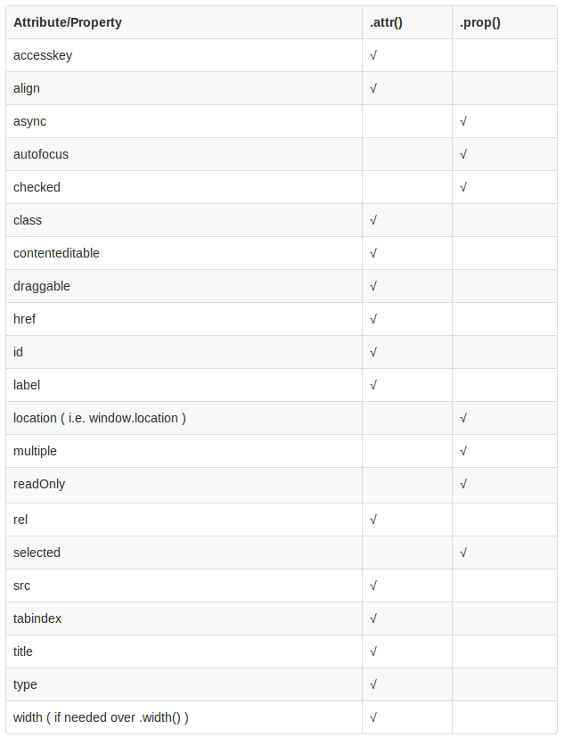

% 核心课程
% jQuery 入门基础课
% jQuery DOM操作和动画特效

## 操作DOM
通过我们前面的学习, 感觉到可以能方便的选择元素, 而利用这个我们也很容易操作HTML文档本身的结构, 也是就是操作DOM, 这是jQuery 最强大的一个功能. 我们将会学习到改变页面的结构的种种方法.


### 创建一个新元素

我们先来创建一个新的元素. 有以下几种方法.

#### 使用DOM API创建新元素

我们可以使用DOM API直接生成HTMLElement对象. 其实jQuery在幕后悄悄地调用DOM API.

```html
<!DOCTYPE html>
<html lang="en">

<head>
    <meta charset="UTF-8">
    <title>创建一个新的元素</title>
    <style media="screen">
    </style>
    <script src="http://code.jquery.com/jquery-latest.js"></script>
    <script type="text/javascript">
    $(document).ready(function(){
      $('.name').append(document.createElement("span"));
      $('span').text(" is full stack develop engineer.")
    });
    </script>
</head>
<body>
  <div class="name">Richard.Wang</div>
  <p class="new"></p>
</body>
</html>
```
`src/demo-1.html`

我们使用document.createElement("span")创建一个span元素, 然后并将这个元素插入到class等于name的div元素中.

----

#### 用clone创建新的元素

```html
<!DOCTYPE html>
<html lang="en">

<head>
    <meta charset="UTF-8">
    <title>创建一个新的元素</title>
    <style media="screen">
    </style>
    <script src="http://code.jquery.com/jquery-latest.js"></script>
    <script type="text/javascript">
    $(document).ready(function(){
      $(".name").clone().appendTo('.new');
    });
    </script>
</head>
<body>
  <div class="name">Richard.Wang</div>
  <p class="new"></p>
</body>
</html>
```

`src/demo-2.html`

----


### 添加子元素或后代元素
创建完元素后, 就需要将它们添加到文档中, 我们先从把一个元素插入到另一个元素内. 生成该元素的子元素或后代元素开始.

#### append()
.append()函数将特定内容插入到每个匹配元素里面的最后面，作为它的最后一个子元素（last child）.插入所有选中的元素中.


1. 可以将HTML元素直接插入到div元素中.

```html
$('div').append('<p>教育科技有限公司.</p>');
```


2. 可以选择一个元素然后插入在另一个元素里面.

```html
$('div').append($('p'));
```

3. 可以回调阳函数动态插入元素

```html
$('div').append(function(index, html){
  return ($('p'));
});
```

根据上面的例子, 现在看完整例子.

```html
<!DOCTYPE html>
<html lang="en">

<head>
    <meta charset="UTF-8">
    <title>创建一个新的元素</title>
    <style media="screen">
    </style>
    <script src="http://code.jquery.com/jquery-latest.js"></script>
    <script type="text/javascript">
    $(document).ready(function(){
      $("#new").append('<span>教育科技有限公司</span>');
      $("#new").append($('.new'));
      $("#new").append(function(index, html){
        console.log(index);
        console.log(html);
        return ($('.name'));
      })
    });
    </script>
</head>
<body>
  <div class="name">Richard.Wang</div>
  <p class="new">HTML5全栈开发</p>
  <div id="new">北京菜鸟在线</div>
</body>
</html>
```

`src/append.html`

* index: 是元素的索引值.
* html: 是元素的内容.

练习: 验证当选中多个元素时, 是不是分别都会插入相应的元素.


----

#### prepend()
prepend()方法会插入新元素到jQuery所有内含元素之内, 使之成为相应元素的第一个子元素, 也就是说插到最前面. 而append是追加, 将元插到最后面.


1. 可以将HTML元素直接插入到div元素中.

```html
$('div').prepend('<p>教育科技有限公司.</p>');
```


2. 可以选择一个元素然后插入在另一个元素里面.

```html
$('div').prepend($('p'));
```

3. 可以回调阳函数动态插入元素

```html
$('div').prepend(function(index, html){
  return ($('p'));
});
```

好, 我们现在试着完成一个整的例子.

* 根据append的例子来实现一下prepend的例子.

```html
<!DOCTYPE html>
<html lang="en">

<head>
    <meta charset="UTF-8">
    <title>创建一个新的元素</title>
    <style media="screen">
    </style>
    <script src="http://code.jquery.com/jquery-latest.js"></script>
    <script type="text/javascript">
    $(document).ready(function(){
      $("#new").prepend('<span>教育科技有限公司</span>');
      $(".name").prepend($('#new'));
      $(".name").prepend(function(index, html){
        console.log(index);
        console.log(html);
        return ($('.new'));
      });
    });
    </script>
</head>
<body>
  <div class="name">Richard.Wang</div>
  <p class="new">HTML5全栈开发</p>
  <div id="new">北京菜鸟在线</div>
</body>
</html>
```

`src/prepend.html`


----


#### appendTo() 和 prependTO()

* appendTo()

.append()和.appendTo()两种方法功能相同，主要的不同是语法——内容和目标的位置不同。对于.append(), 选择表达式在函数的前面，参数是将要插入的内容。对于.appendTo()刚好相反，内容在方法前面，无论是一个选择器表达式 或创建作为标记上的标记，它都将被插入到目标容器的末尾。

```HTML
<!DOCTYPE html>
<html lang="en">

<head>
    <meta charset="UTF-8">
    <title>创建一个新的元素</title>
    <style media="screen">
    </style>
    <script src="http://code.jquery.com/jquery-latest.js"></script>
    <script type="text/javascript">
    $(document).ready(function(){
      $('<span>教育科技有限公司</span>').appendTo('#new');
      $("#new").appendTo($('.new'));
    });
    </script>
</head>
<body>
  <div class="name">Richard.Wang</div>
  <p class="new">HTML5全栈开发</p>
  <div id="new">北京菜鸟在线</div>
</body>
</html>
```
`src/appendto.html`

----

* prependTo()

.prepend()和.prependTo()实现同样的功能，主要的不同是语法，插入的内容和目标的位置不同。 对于 .prepend() 而言，选择器表达式写在方法的前面，作为待插入内容的容器，将要被插入的内容作为方法的参数。而 .prependTo() 正好相反，将要被插入的内容写在方法的前面，可以是选择器表达式或动态创建的标记，待插入内容的容器作为参数。


* 根据上面的例子, 自己实现这个方法的使用.

```html
<!DOCTYPE html>
<html lang="en">

<head>
    <meta charset="UTF-8">
    <title>创建一个新的元素</title>
    <style media="screen">
    </style>
    <script src="http://code.jquery.com/jquery-latest.js"></script>
    <script type="text/javascript">
    $(document).ready(function(){
      $('<span>教育科技有限公司</span>').prependTo('#new');
      $("#new").prependTo($('.new'));
    });
    </script>
</head>
<body>
  <div class="name">Richard.Wang</div>
  <p class="new">HTML5全栈开发</p>
  <div id="new">北京菜鸟在线</div>
</body>
</html>
```

`src/prependto.html`

----


### 封装
jQuery还提供了一些把新元素作为现有元素的父元素或者祖先元素插入到页面的方法. 把这些方法称为封装方法.

#### wrap()
.wrap()函数可以接受任何字符串或对象，可以传递给$()工厂函数来指定一个DOM结构。这种结构可以嵌套了好几层深，但应该只包含一个核心的元素。每个匹配的元素都会被这种结构包裹。该方法返回原始的元素集，以便之后使用链式方法。

```html
<!DOCTYPE html>
<html lang="en">

<head>
    <meta charset="UTF-8">
    <title>创建一个新的元素</title>
    <style media="screen">
    </style>
    <script src="http://code.jquery.com/jquery-latest.js"></script>
    <script type="text/javascript">
    $(document).ready(function(){
      var newElem = $("<div></div>").css('border', '1px solid red');
      $('#new').wrap(newElem);
    });
    </script>
</head>
<body>
  <div id="all">
    <div class="name">Richard.Wang</div>
    <p class="new">HTML5全栈开发</p>
    <div id="new">北京菜鸟在线</div>
  </body>
  </div>

</html>
```
`src/wrap.html`

------


#### wrapAll()
.wrapAll()函数可以接受任何字符串或对象，可以传递给$()工厂函数来指定一个DOM结构。这种结构可以嵌套多层，但是最内层只能有一个元素。所有匹配元素将会被当作是一个整体，在这个整体的外部用指定的 HTML 结构进行包裹。

```html
<!DOCTYPE html>
<html lang="en">

<head>
    <meta charset="UTF-8">
    <title>创建一个新的元素</title>
    <style media="screen">
    </style>
    <script src="http://code.jquery.com/jquery-latest.js"></script>
    <script type="text/javascript">
    $(document).ready(function(){
      var newElem = $("<div></div>").css('border', '1px solid red');
      $('.new').wrapAll(newElem);
    });
    </script>
</head>
<body>
  <div id="all">
    <div class="new">Richard.Wang</div>
    <p class="new">HTML5全栈开发</p>
    <div id="new">北京菜鸟在线</div>
  </body>
  </div>

</html>
```

`src/wrapall.html`


* 思考: wrap()和wrapAll()的区别是什么?

-----


#### wrapInner()
.wrapInner()函数可以接受任何字符串或对象，可以传递给$()工厂函数来指定一个DOM结构。这种结构可以嵌套多层，但是最内层只能有一个元素。每个匹配元素的内容都会被这种结构包裹。

```html
<!DOCTYPE html>
<html lang="en">

<head>
    <meta charset="UTF-8">
    <title>创建一个新的元素</title>
    <style media="screen">
    .new { border: 2px solid blue;};
    </style>
    <script src="http://code.jquery.com/jquery-latest.js"></script>
    <script type="text/javascript">
    $(document).ready(function(){
      var newElem = $('<div class="inner"></div>').css('border', '1px solid red');
      $('.new').wrapInner(newElem);
    });
    </script>
</head>
<body>
  <div id="all">
    <div class="new">Richard.Wang</div>
    <p class="new">HTML5全栈开发</p>
    <div id="new">北京菜鸟在线</div>
  </body>
  </div>

</html>
```

`src/wrapinner.html`

* 练习: 如果在class=new后增加新的文本显示.

* 注意: warp()和wrapInner()都可以实现回调函数.
* 练习: 实现这两个函数的回调函数的使用.

```html
$('div').warp(function(index){
  return ();
});
```
```html
<!DOCTYPE html>
<html lang="en">

<head>
    <meta charset="UTF-8">
    <title>创建一个新的元素</title>
    <style media="screen">
    </style>
    <script src="http://code.jquery.com/jquery-latest.js"></script>
    <script type="text/javascript">
    $(document).ready(function(){
      var newElem1 = $('<div class="inner"></div>').css('border', '1px solid red');
      var newElem2 = $('<div class="inner"></div>').css('border', '1px solid blue');
      $('.new').wrap(function(index){
        console.log(index);
        if(index / 2){
          return newElem1;
        }else {
          return newElem2;
        }
      });
      $('.new').wrapInner(function(index){
        if(index / 2){
          return newElem1;
        }else {
          return newElem2;
        }
      })
    });
    </script>
</head>
<body>
  <div id="all">
    <div class="new">Richard.Wang</div>
    <p class="new">HTML5全栈开发</p>
    <div id="new">北京菜鸟在线</div>
  </body>
  </div>

</html>
```


`src/wrapinner-fun.html`


-----


### 插入兄弟元素
jQuery也提供了插入兄弟元素到页面其他元素旁的方法.


* after()

.after() 和.insertAfter()实现同样的功能。主要的不同是语法——内容和目标的位置不同。 对于.after(),要插入的内容来自方法的参数：$(target).after(contentToBeInserted)。 对于.insertAfter()， 刚好相反，内容在方法前面并且插入到目标的前面， 而目标是传递给.insertAfter()方法的参数： $(contentToBeInserted).insertAfter(target)。

例子:

请看下面的HTML:

```html
<div class="container">
  <h2>HTML5</h2>
  <div class="inner">Hello</div>
  <div class="inner">Goodbye</div>
</div>
```

我们可以创建内容然后同时插在好几个元素后面:

```html
$('.inner').after('<p>Test</p>');
```

每个内部的 <div> 元素得到新的内容:

```html
<div class="container">
  <h2>HTML5</h2>
  <div class="inner">Hello</div>
  <p>Test</p>
  <div class="inner">Goodbye</div>
  <p>Test</p>
</div>
```

* 练习, 根据上面的例子, 请写出完整示例代码.

```html
<!DOCTYPE html>
<html lang="en">
<head>
    <meta charset="UTF-8">
    <title>创建一个新的元素</title>
    <style media="screen">
    </style>
    <script src="http://code.jquery.com/jquery-latest.js"></script>
    <script type="text/javascript">
    $(document).ready(function(){
      $('.new').after('<span>开源世界!!!</span>');
      $('#new').after(function(index, html){
        return ('<h3>'+ index +'</h3>');
      })
    });
    </script>
</head>
<body>
  <div id="all">
    <div class="new">Richard.Wang</div>
    <p class="new">HTML5全栈开发</p>
    <div id="new">北京菜鸟在线</div>
  </body>
  </div>

</html>
```
`src/after.html`


-----


* insertAftef()

The .after()和.insertAfter() 实现同样的功能。主要的不同是语法——特别是（插入）内容和目标的位置。 对于 .after(), 选择表达式在函数的前面，参数是将要插入的内容。对于 .insertAfter(), 刚好相反，内容在方法前面，它将被放在参数里元素的后面。


请看下面的HTML：

```html
<div class="container">
  <h2>HTML5</h2>
  <div class="inner">Hello</div>
  <div class="inner">Goodbye</div>
</div>
```

我们可以创建内容然后同时插在好几个元素后面：

```html
$('<p>Test</p>').insertAfter('.inner');
```

结果如下：

```html
<div class="container">
  <h2>HTML5</h2>
  <div class="inner">Hello</div>
  <p>Test</p>
  <div class="inner">Goodbye</div>
  <p>Test</p>
</div>
```


* 练习想一下, 我们学过的那几对函数和这个函数的用法一样, 写一下例子.

完整参考事例:
```html
<!DOCTYPE html>
<html lang="en">
<head>
    <meta charset="UTF-8">
    <title>创建一个新的元素</title>
    <style media="screen">
    </style>
    <script src="http://code.jquery.com/jquery-latest.js"></script>
    <script type="text/javascript">
    $(document).ready(function(){
      $('<span>开源世界!!!</span>').insertAfter('.new');
    });
    </script>
</head>
<body>
  <div id="all">
    <div class="new">Richard.Wang</div>
    <p class="new">HTML5全栈开发</p>
    <div id="new">北京菜鸟在线</div>
  </body>
  </div>

</html>
```

`src/insertafter.html`

-----

* before()

.before() 和.insertBefore()实现同样的功能。主要的不同是语法——内容和目标的位置不同。 对于.before(),要插入的内容来自方法的参数：$(target).before(contentToBeInserted)。 对于.insertBefore()， 刚好相反，内容在方法前面并且插入到目标的前面， 而目标是传递给.insertBefore()方法的参数： $(contentToBeInserted).insertBefore(target)。

例子:

请看下面的HTML:

```html
<div class="container">
  <h2>HTML5</h2>
  <div class="inner">Hello</div>
  <div class="inner">Goodbye</div>
</div>
```

我们可以创建内容然后同时插在好几个元素后面:

```html
$('.inner').before('<p>Test</p>');
```

每个内部的 <div> 元素得到新的内容:

```html
<div class="container">
  <h2>HTML5</h2>
  <p>Test</p>
  <div class="inner">Hello</div>
  <p>Test</p>
  <div class="inner">Goodbye</div>
</div>
```

* 练习, 根据上面的例子, 请写出完整示例代码.


```html
<!DOCTYPE html>
<html lang="en">
<head>
    <meta charset="UTF-8">
    <title>创建一个新的元素</title>
    <style media="screen">
    </style>
    <script src="http://code.jquery.com/jquery-latest.js"></script>
    <script type="text/javascript">
    $(document).ready(function(){
      $('.new').before('<span>开源世界!!!</span>');
      $('#new').before(function(index, html){
        return ('<h3>'+ index +'</h3>');
      })
    });
    </script>
</head>
<body>
  <div id="all">
    <div class="new">Richard.Wang</div>
    <p class="new">HTML5全栈开发</p>
    <div id="new">北京菜鸟在线</div>
  </body>
  </div>

</html>
```

`src/before.html`


-----


* insertbefore()
The .before()和.insertBefore()实现同样的功能。主要的区别是语法——内容和目标的位置。 对于 .before()，选择表达式在函数前面，内容作为参数，而.insertBefore()刚好相反，内容在方法前面，它将被放在参数里元素的前面。

请看下面的HTML：

```html
<div class="container">
  <h2>HTML5</h2>
  <div class="inner">Hello</div>
  <div class="inner">Goodbye</div>
</div>
```

我们可以创建内容然后同时插在好几个元素后面：

```html
$('<p>Test</p>').insertBefore('.inner');
```

结果如下：

```html
<div class="container">
  <h2>HTML5</h2>
  <p>Test</p>
  <div class="inner">Hello</div>
  <p>Test</p>
  <div class="inner">Goodbye</div>
</div>
```

* 练习: 根据前面的学习, 现在自己去写一个例子来验证这个函数的使用.

```html
<!DOCTYPE html>
<html lang="en">
<head>
    <meta charset="UTF-8">
    <title>创建一个新的元素</title>
    <style media="screen">
    </style>
    <script src="http://code.jquery.com/jquery-latest.js"></script>
    <script type="text/javascript">
    $(document).ready(function(){
      $('<span>开源世界!!!</span>').insertBefore('.new');
    });
    </script>
</head>
<body>
  <div id="all">
    <div class="new">Richard.Wang</div>
    <p class="new">HTML5全栈开发</p>
    <div id="new">北京菜鸟在线</div>
  </body>
  </div>

</html>
```

`src/insertbefore.html`

-----


### 替换元素

jQuery也提供了一组, 替换元素的函数, 我们接下来看一下他们的使用.

#### replaceWith()

.replaceWith()可以从DOM中移除内容，然后在这个地方插入新的内容。

请看下面的例子：

```html
<div class="container">
  <div class="inner first">Hello</div>
  <div class="inner second">And</div>
  <div class="inner third">Goodbye</div>
</div>
```

我们可以用指定的HTML替换第二个 inner <div> ：

```html
$('div.second').replaceWith('<h2>New heading</h2>');
```

结果如下：

```html
<div class="container">
  <div class="inner first">Hello</div>
  <h2>New heading</h2>
  <div class="inner third">Goodbye</div>
</div>
```

完整示例代码:

```html
<!DOCTYPE html>
<html lang="en">
<head>
    <meta charset="UTF-8">
    <title>创建一个新的元素</title>
    <style media="screen">
     mydiv {border: 1px solid red}
    </style>
    <script src="http://code.jquery.com/jquery-latest.js"></script>
    <script type="text/javascript">
    $(document).ready(function(){
      //$('#new').replaceWith('<span>开源世界!!!</span>');
      $('#new').replaceWith(function(index){
        console.log(index);
        return $('#name').html($(this).contents());
      });

    });
    </script>
</head>
<body>
  <div id="all">
    <div class="new">Richard.Wang</div>
    <p class="new">HTML5全栈开发</p>
    <div id="new">北京菜鸟在线</div>
    <p id="name"></p>
  </body>
  </div>

</html>
```

`src/replacewith.html`


* 练习: 如果实现当单击按钮后, 将替换内容.


-----

#### replaceAll()
.replaceAll()和.replaceWith()功能类似，但是目标和源相反。

请看下面的HTML:

```html
<div class="container">
  <div class="inner first">Hello</div>
  <div class="inner second">And</div>
  <div class="inner third">Goodbye</div>
</div>
```

我们可以创建一个元素然后用它替换其它元素：

```html
$('<h2>New heading</h2>').replaceAll('.inner');
```

结果如下：

```html
<div class="container">
  <h2>New heading</h2>
  <h2>New heading</h2>
  <h2>New heading</h2>
</div>
```

或者，我们也可以选择一个元素用来替换其它的:

```html
$('.first').replaceAll('.third');
```

DOM结构的结果：

```html
<div class="container">
  <div class="inner second">And</div>
  <div class="inner first">Hello</div>
</div>
```
从这个例子可以看出，用来替换的元素从老地方移到新位置，而不是复制。

* 注意事项: .replaceAll() 方法会删除与节点相关联的所有数据和事件处理程序 。


* 练习: 根据上面的例子, 写出一个完整事例代码.
* 练习: 增加一个按钮, 当单击按钮进, 将进行替换操作.


----


### 删除元素


#### detach()
.detach() 方法和.remove()一样, 除了 .detach()保存所有jQuery数据和被移走的元素相关联。当需要移走一个元素，不久又将该元素插入DOM时，这种方法很有用。


```html
<!DOCTYPE html>
<html lang="en">
<head>
    <meta charset="UTF-8">
    <title>创建一个新的元素</title>
    <style media="screen">
     #name {border: 1px solid red}
    </style>
    <script src="http://code.jquery.com/jquery-latest.js"></script>
    <script type="text/javascript">
    $(document).ready(function(){
      $('#name').click(function(){
        $(this).detach();
      });
    });
    </script>
</head>
<body>
  <div id="all">
    <div class="new">Richard.Wang</div>
    <p class="new">HTML5全栈开发</p>
    <div id="new">北京菜鸟在线</div>
    <p id="name">请单击这里, 这一行将被删除!</p>
  </body>
  </div>

</html>
```

`src/detach.html`

----


#### empty()
这个方法不仅移除子元素（和其他后代元素），同样移除元素里的文本。因为，根据说明，元素里任何文本字符串都被看做是该元素的子节点。

请看下面的HTML:


```html
<div class="container">
  <div class="hello">Hello</div>
  <div class="goodbye">Goodbye</div>
</div>
```

我们可以移除里面的任何元素

```html
$('.hello').empty();
```

结果文本 Hello文本被删除：

```html
<div class="container">
  <div class="hello"></div>
  <div class="goodbye">Goodbye</div>
</div>
```

如果 <div class="hello">里面包含任何数量的嵌套元素，他们也会被移走。

为了避免内存泄漏，jQuery先移除子元素的数据和事件处理函数，然后移除子元素。

如果你想删除元素，不破坏他们的数据或事件处理程序（这些绑定的信息还可以在之后被重新添加回来），请使用.detach()代替 。


```html
<!DOCTYPE html>
<html lang="en">
<head>
    <meta charset="UTF-8">
    <title>创建一个新的元素</title>
    <style media="screen">
    </style>
    <script src="http://code.jquery.com/jquery-latest.js"></script>
    <script type="text/javascript">
    $(document).ready(function(){
      $('#new').click(function(){
        $(this).empty();
      })
    });
    </script>
</head>
<body>
  <div id="all">
    <div id="new">单击这里, 这一行和下面的子元素将会被删除.
      <p class="new">HTML5全栈开发</p>
    </div>
    <div class="new">北京菜鸟在线</div>
  </body>
  </div>

</html>
```

`src/empty.html`


----

#### remove()

.remove() 将元素移出DOM。 当我们想将元素自身移除时我们用 .remove()，同时也会移除元素内部的一切，包括绑定的事件及与该元素相关的jQuery数据。要删除的元素不删除数据和事件的情况下，使用.detach()来代替。

请看下面的HTML:

```html
<div class="container">
  <div class="hello">Hello</div>
  <div class="goodbye">Goodbye</div>
</div>
```

可以移除任何想要移除的元素:

```html
$('.hello').remove();
```

结果如下：

```html
<div class="container">
  <div class="goodbye">Goodbye</div>
</div>
```

如果<div class="hello">元素里面有子元素，他们同样会被移除。还有元素上的事件及 jQuery 数据也会被删除。

我们也可以添加一个可选的选择器参数来过滤匹配的元素。例如，前面的代码可以重写为：

```html
$('div').remove('.hello');
```

结果将一样：

```html
<div class="container">
  <div class="goodbye">Goodbye</div>
</div>
```

* 思考, remove和empty有什么区别.

代码示例:

```html
<!DOCTYPE html>
<html lang="en">
<head>
    <meta charset="UTF-8">
    <title>创建一个新的元素</title>
    <style media="screen">
    </style>
    <script src="http://code.jquery.com/jquery-latest.js"></script>
    <script type="text/javascript">
    $(document).ready(function(){
      $('#new').click(function(){
        $(this).remove();
      })
    });
    </script>
</head>
<body>
  <div id="all">
    <div id="new">单击这里, 这一行和下面的子元素将会被删除.
      <p class="new">HTML5全栈开发</p>
    </div>
    <div class="new">北京菜鸟在线</div>
  </body>
  </div>

</html>
```

`src/remove.html`


----

#### unwrap()
.unwrap()删除元素的父级元素。和 .wrap()的功能相反。匹配的元素（以及他们的兄弟元素，如果有的话）取代他们的父母在DOM结构。


```html
<!DOCTYPE html>
<html lang="en">

<head>
    <meta charset="UTF-8">
    <title>创建一个新的元素</title>
    <style media="screen">
    </style>
    <script src="http://code.jquery.com/jquery-latest.js"></script>
    <script type="text/javascript">
    $(document).ready(function(){
      var newElem = $("<div></div>").css('border', '1px solid red');
      $('#new').wrap(newElem);
      $('button#delete').click(function(){
        $('#new').unwrap();
      })
      $('button#add').click(function(){
        $('#new').wrap(newElem);
      })
    });
    </script>
</head>
<body>
  <div id="all">
    <div class="name">Richard.Wang</div>
    <p class="new">HTML5全栈开发</p>
    <div id="new">北京菜鸟在线</div>
    <button id = "delete" type="button" name="button">去掉红框</button>
    <button id = "add" type="button" name="button">加上红框</button>
  </body>
  </div>

</html>
```

`src/unwrap.html`

* 练习: 实现有红框再单击后增加红框, 不会再次增加红框.

----

## 处理元素

我们一起学习一下用jQuery处理元素的方法, 包括获取和设置元素的属性, 使用jQuery便捷方法处理样式类和CSS属性, 获取和设置元素的HTML或文本内容.


### 处理class属性
下面的我们先学习一下, 处理元素字面属性和元素对象定义属性.

#### attr
* 描述: 获取匹配的元素集合的第一个元素的属性的值或设置每一个匹配元素的一个或多个属性. attr()方法只获取第一个匹配元素的属性值, 要获取每个单独的元素的属性值, 我要使用.each()或.map()方法循环.

```html
.attr(attributeName)
.attr(attributeName, value)
.attr({attributeName1: value, attributeName2: value, ...})
.attr(attributeName, function(index, attr){})
```

* 事例讲解:

如果.attr()方法是一个设置属性值的方法而且强大的途径, 特别是当设置多个属性或使用值来函数. 让我们看一下具体使用方法, 下面有一个图片:
```html

```

* .attr(attributeName, value) 设置一个简单的属性
```html
$("#logophoto").attr('alt', 'BeiJing Brush Seller');
```

* 如果使用上面方法添加新的属性
```html
$("#logophoto").attr('title', 'Photo by logo.');
```

* 如果我们一次要设置多个属性
```html
$("#logophoto").attr({
    alt: 'BeiJing Brush Seller',
    title: 'Photo by logo.'
});
```

注意: 当设置样式名("class")属性时, 必须使用引号.

* 使用函数
```html
$("#logophoto").attr('title', function(index, attr){
    return attr + ' - Photo by logo.'
});
```

* index: 是接收该元素在集合中索引值.
* attr: 原来属性作为参数. 如果原来属性没有设置, 那么它将是undefined.
* 如果要想使用获取更多的属性值可以使用 this.属性名 方法来实现.


事例代码:

```html
<!DOCTYPE html>
<html lang="en">

<head>
    <meta charset="UTF-8">
    <title>Selector Button</title>
    <style media="screen">
    div {
        margin: 20px;
        padding: 10px;
        border: 1px solid black;
        height: auto;
        width: auto;
        border-radius: 3px;
        float: left;
        display: inline-block;
    }
    </style>
    <script src="http://code.jquery.com/jquery-latest.js"></script>
</head>

<body>
    <div>
        
    </div>
    <div>
        
    </div>
    <div id="text"></div>

    <script>
    $("#html").attr({
        src: "./hlogo.png",
        alt: "html logo",
    });
    $("#logo").attr("title", function(index, attr){
        $(this).attr({
            src: './logo.png',
            alt: 'cainiao logo',
        });
        console.log(index);
        console.log(attr);
        return index + " - " + attr + " - Photo by logo.";
    });
    $("#text").text($("#logo").attr("title"));
    </script>

</body>
</html>
```
`api-2/src/01.attr.html`


----

#### prop
* 描述: 获取匹配的元素集第一个元素的属性(property)值或设置每一个匹配元素的一个或多个属性.

```html
.prop(propertyName);
.prop(propertyName, value);
.prop(property);
.prop(propertyName, function(index, PropertyValue){});
```

* 事例讲解:

下面以Checeked属性显示一个复选框, 获取它的变化和属性.

```html
<input id="mycheck" type="checkbox" name="check1" value="1" checked="checked">
<label for="mycheck">单击</label>
<p></p>
```

* 设置属性值
```html
$("input").prop("name", "new name");
```

* 设置多个属性值
```html
$("input").prop({
    name: 'cool name',
    disabled: false,
});
```

* 使用函数
```html
$("input").prop("checked", function(index, PropertyValue){
    return PropertyValue + " - new word.";
})
```

* index: 是接收该元素在集合中索引值.
* PropertyValue: 原来属性作为参数. 如果原来属性没有设置, 那么它将是undefined.
* 如果要想使用获取更多的属性值可以使用 this.属性名 方法来实现.


事例代码:

```html
<!DOCTYPE html>
<html lang="en">

<head>
    <meta charset="UTF-8">
    <title>CSS</title>
    <style media="screen">
    div {
        margin: 20px;
        padding: 10px;
        border: 1px solid black;
        height: auto;
        width: auto;
        border-radius: 3px;
        float: left;
        display: inline-block;
    }
    </style>
    <script src="http://code.jquery.com/jquery-latest.js"></script>
</head>

<body>
    <div>
        
    </div>
    <div>
        
    </div>
    <div id="text"></div>

    <script>
    $("#html").prop({
        src: "./hlogo.png",
        alt: "html logo",
    });
    $("#logo").prop("title", function(index, propertyvalue){
        $(this).prop({
            src: './logo.png',
            alt: 'cainiao logo',
        });
        console.log(index);
        console.log(propertyvalue);
        return index + " - " + propertyvalue + " - Photo by logo.";
    })
    $("#text").text($("#logo").prop("title"));
    </script>

</body>
</html>
```
`api-2/src/02.prop.html`

#### attr()和prop()的使用

* attr()和prop()的两者的使用, 根据官方的建议：具有 true 和 false 两个属性的属性，如 checked, selected 或者 disabled 使用prop()，其他的使用 attr().
具体见下表：



----


#### removeAttr(attributeName)
* 描述: 为匹配的元素集合中的每个元素中移除一个属性, 如果要毛移除多个属性名, 以空格分隔属性列表.

代码事例:

```html
<!DOCTYPE html>
<html lang="en">

<head>
    <meta charset="UTF-8">
    <title>CSS</title>
    <style media="screen">
    div {
        margin: 20px;
        padding: 10px;
        border: 1px solid black;
        height: auto;
        width: auto;
        border-radius: 3px;
        float: left;
        display: inline-block;
    }
    </style>
    <script src="http://code.jquery.com/jquery-latest.js"></script>
</head>

<body>
    <div>
        
    </div>
    <div>
        
    </div>

    <script>
    $("#html").prop({
        src: "./hlogo.png",
        alt: "html logo",
    });

    $("#logo").prop("title", function(index, propertyvalue){
        $(this).prop({
            src: './logo.png',
            alt: 'cainiao logo',
        });
        return index + " - " + propertyvalue + " - Photo by logo.";
    });
    $('#hlogo').removeAttr('id');
    $("#logo").removeAttr('id src');
    </script>

</body>
</html>

```

`api-2/src/03.removeattr.html`

----

#### removeProp()
* 描述: 为集合中匹配的元素删除一个属性. removeProp()方法用来删除.prop()方法设置的属性集.
* 注意: 不要使用此方法来删除原生的属性, 比如checked, disabled或selected. 这将完全移除该属性, 一旦移除, 不能再次被添加到元素上, 使用.prop来设置这些属性值为false代替.

代码事例:

```html
<!DOCTYPE html>
<html lang="en">

<head>
    <meta charset="UTF-8">
    <title>CSS</title>
    <style media="screen">
    div {
        margin: 20px;
        padding: 10px;
        border: 1px solid black;
        height: auto;
        width: auto;
        border-radius: 3px;
        float: left;
        display: inline-block;
    }
    </style>
    <script src="http://code.jquery.com/jquery-latest.js"></script>
</head>

<body>
    <div>
        
    </div>
    <div>
        
    </div>

    <script>
    $("#html").prop({
        src: "./hlogo.png",
        alt: "html logo",
    });

    $("#logo").prop("title", function(index, propertyvalue){
        $(this).prop({
            src: './logo.png',
            alt: 'cainiao logo',
        });
        return index + " - " + propertyvalue + " - Photo by logo.";
    });
    $('#hlogo').removeAttr('id');
    $("#logo").removeAttr('id src');
    </script>

</body>
</html>
```

`api-2/src/04.removeprop.html`
----


### 处理CSS样式
我们也可以使用处理属性的常规方法处理class属性, 不过jQuery还提供一套更方便的方法.

#### addClass()
* 描述: 为每个匹配的元素添加指定的样式类名, 值得注意的是这个方法不会替换一个样式类名。它只是简单的添加一个样式类名到元素上。对所有匹配的元素可以一次添加多个用空格隔开的样式类名.


```html
.addClass(className);
className: 为每个匹配元素所要增加的一个或多个样式名.

.addClass(function(index, currentClass){});
这个函数返回一个或更多用空格隔开的要增加的样式名。
接收index参数表示元素在匹配集合中的索引位置和html参数表示元素上原来的HTML内容。
在函数中this指向匹配元素集合中的
```

代码事例: 在匹配的元素上加上'selected'样式。

```html
<!DOCTYPE html>
<html lang="en">

<head>
    <meta charset="UTF-8">
  <style>
  p { margin: 8px; font-size:16px; }
  .selected { color:blue; }
  .highlight { background:yellow; }
  </style>
  <script src="http://code.jquery.com/jquery-latest.js"></script>
</head>
<body>

  <p class="selected" >Hello</p>
  <p>and</p>
  <p>Goodbye</p>
  <div></div>

<script>
  $("p").last().addClass("selected");
  //$("p").last().addClass("selected highlight");
  $("p").first().addClass(function(index, currentClass){
      console.log(currentClass);
      var myred;
      if(currentClass == "selected"){
          myred = "highlight";
          $("div").text("第一个P标签字体改为蓝色, 背景为黄色.");
      }
      return myred;
  })
  </script>

</body>
</html>

```

`api-2/src/css/01.addclass.html`

----

#### css()
* 描述: 获取匹配元素集合中的第一个元素的样式属性的计算值或设置每个匹配元素的一个或多个CSS属性.

代码事例:

```html
<!DOCTYPE html>
<html lang="en">

<head>
    <meta charset="UTF-8">
  <style>
  div {
      width: 100px;
      height: 100px;
      margin-left: 20px;
      margin-top: 20px;
      margin-right: 5px;
      margin-bottom: 20px;
      float: left;
      padding: 5px;
      text-align: center;
  }
  .one, .five { background-color: blue; color: white;}
  .two { background-color: rgb(255, 0, 0); color: white;}
  .three { background-color: rgba(255, 0, 0, 0.5); color: white;}
  .fure { background-color:  #eeff00;}
  #result { border: 1px solid black; height: auto; width: auto; display: inherit; }
  hr { clear: both;}
  </style>
  <script src="http://code.jquery.com/jquery-latest.js"></script>
</head>
<body>

    <div class="one">单击</div>
    <div class="two">单击</div>
    <div class="three">单击</div>
    <div class="fure">单击</div>
    <div id="result">显示颜色</div>
    <hr>
    <div class="five">单击 我会长</div>

  <script>
      $("div").click(function(){
          var c = $(this).css("background-color");
          console.log(c);
          $("#result").html("单击这个div的颜色是: <span style = 'color:"+c+";'>"+ c +"</span>");
      });

      $(".five").click(function (){
          $(this).css({
              width: function(index, value){
                  console.log(value);
                  return parseFloat(value) + 10;
              }, height: function(index, value){
                  return parseFloat(value) + 10;
              }
          });
      });

  </script>

</body>
</html>
```
`api-2/src/css/02.css.html`

----


#### removeClass
* 描述: 移除集合中每个匹配元素上一个, 多个或全部样式. 如果一个样式类名作为一个参数,只有这样式类会被从匹配的元素集合中删除. 如果没有样式名作为参数，那么所有的样式类将被移除。

* 一般会合.addClass联合使用, 去掉原来的样式, 再重新设置新的样式.

代码事例:

```html
<!DOCTYPE html>
<html lang="en">

<head>
    <meta charset="UTF-8">
  <style>
  p { margin: 4px; font-size:16px; font-weight:bolder; }
 .blue { color:blue; }
 .under { text-decoration:underline; }
 .highlight { background:yellow;  display: inline;}
  </style>
  <script src="http://code.jquery.com/jquery-latest.js"></script>
</head>
<body>
    <p class="blue under">Hello</p>
    <p class="blue under highlight">and</p>
    <p class="blue under">then</p>
    <p class="blue under">Goodbye</p>
<script>
$("p:first").removeClass("blue");
$("p:eq(1)").removeClass().addClass("highlight");
$('p:last').removeClass(function() {
    console.log($(this).prev().attr('class'));
  return $(this).prev().attr('class');
});
</script>

</body>
</html>
```

`api-2/src/css/05.removeclass.html`

* 注: 最后函数是, 获取最后p元素的前一个元素的样式名称, 并最在最后一个p元素删除前一个元素所包含的样式.


----


#### toggleClass()
* 描述: 为匹配的元素集合中的每一个元素上添加或删除一个或多个样式类, 取次于这个样式类是否存在或state参数的值.

代码事例:

```html
<!DOCTYPE html>
<html lang="en">

<head>
    <meta charset="UTF-8">
  <style>
  p { margin: 4px; font-size:16px; font-weight:bolder; }
 .blue { color:blue; }
 .under { text-decoration:underline; }
 .highlight { background:yellow;  display: inline;}
  </style>
  <script src="http://code.jquery.com/jquery-latest.js"></script>
</head>
<body>
    <p class="blue under">Hello</p>
    <p class="blue under">and</p>
    <p class="blue under">then</p>
    <p class="blue under">Goodbye</p>
<script>
$("p").click(function() {
    $(this).toggleClass("highlight");
});
</script>

</body>
</html>
```
`api-2/src/css/06.toggleClass.html`

----


#### hasClass()
* 描述: 确定任何一个匹配元素是否有被分配给定的样式类. 元素可能会有个的样式名. 在HTML中, 使用空格来分隔多个样式.
```html
<div class="mydiv" class="foo bar"></div>     
```

如果匹配元素上有指定的样式，那么.hasClass() 方法将返回 true ， 即使元素上可能还有其他样式。 举个例子, 给上文的HTML加上下面的代码将返回 true：

```html
1. $('#mydiv').hasClass('foo')
2. $('#mydiv').hasClass('bar')
```

然而这会返回false:

```html
$('#mydiv').hasClass('quux')
```

代码事例:

```html
<!DOCTYPE html>
<html lang="en">

<head>
    <meta charset="UTF-8">
  <style>
  </style>
  <script src="http://code.jquery.com/jquery-latest.js"></script>
</head>
<body>

  <p>This paragraph is black and is the first paragraph.</p>
  <p class="selected">This paragraph is red and is the second paragraph.</p>

  <div id="result1">First paragraph has selected class: </div>
  <div id="result2">Second paragraph has selected class: </div>
  <div id="result3">At least one paragraph has selected class: </div>
<script>
$("div#result1").append($("p:first").hasClass("selected").toString());
$("div#result2").append($("p:last").hasClass("selected").toString());
$("div#result3").append($("p").hasClass("selected").toString());
</script>

</body>
</html>
```

`api-2/src/css/04.hasclass.html`

----

#### html()

获取集合中第一个匹配元素的HTML内容

在一个 HTML 文档中, 我们可以使用 .html() 方法来获取任意一个元素的内容。 如果选择器匹配多个元素，那么只有第一个匹配元素的 HTML 内容会被获取。

考虑下面的代码：

```html
$('div.demo-container').html();
```

下文的获取的<div>的内容， 必定是在文档中的第一个class="demo-container"的div中获取的：

```html
<div class="demo-container">
  <div class="demo-box">Demonstration Box</div>
</div>
```

结果如下:

```html
<div class="demo-box">Demonstration Box</div>
```

这种方法使用浏览器的innerHTML 属性。有些浏览器返回的结果可能不是原始文档的 HTML 源代码。例如，如果属性值只包含字母数字字符，Internet Explorer有时丢弃包裹属性值的引号。

* 注意事项：

设计上，一些jQuery的构造函数或方法接受一个HTML字符串 —— jQuery(), .append(), .after()等 —— 有可能执行代码。 这可能造成注入脚本标记或使用HTML属性的执行代码 （例如，）。 不要使用这些方法插入来自不受信任来源的字符串， 如URL查询参数，cookies或表单输入。 这样做可能引起跨站点脚本（XSS）漏洞。 添加内容到文档之前应该删除或过滤掉任何用户输入。

```html
<!DOCTYPE html>
<html lang="en">

<head>
    <meta charset="UTF-8">
    <title>创建一个新的元素</title>
    <style media="screen">
    </style>
    <script src="http://code.jquery.com/jquery-latest.js"></script>
    <script type="text/javascript">
    $(document).ready(function(){
      $('.name').click(function(){
        $('.new').text($(this).html());
      })
    });
    </script>
</head>
<body>
  <div class="name">Richard.Wang</div>
  <p class="new"></p>
</body>
</html>
```

'src/html.html'

----

### 处理表单元素

我们会用val方法来获取和设置表单元素的值.

#### val()
* 描述: 获取匹配的元素集合中第一个元素的当前值或设置匹配的元素集合中每个元素的值.
* .val()方法主要用于获取表单元素的值，如input, select 和 textarea。当在一个空集合上调用，它返回undefined.
* 当该集合中第一个元素是一个select-multiple（即，select元素设置了multiple属性），.val()返回一个包含每个选择项值的数组。
* 在jQuery 3.0中， 如果没有选项被选中，它将返回一个空数组；在jQuery 3.0之前的版本中， 它将返回null。

代码事例:

```html
<!DOCTYPE html>
<html lang="en">

<head>
    <meta charset="UTF-8">
    <title>CSS</title>
    <style media="screen">
        div {
            margin: 20px;
            padding: 10px;
            border: 1px solid black;
            height: auto;
            width: auto;
            border-radius: 3px;
            float: left;
            display: inline-block;
            color: blue;
        }
    </style>
    <script src="http://code.jquery.com/jquery-latest.js"></script>
</head>

<body>
<div>
  <select id="single">
    <option>Single</option>
    <option>Single2</option>
  </select>
  <select id="multiple" multiple="multiple">
    <option selected="selected">Multiple</option>
    <option>Multiple2</option>
    <option selected="selected">Multiple3</option>
  </select><br/>
    <input type="checkbox" name="checkboxname" value="check1" /> check1
    <input type="checkbox" name="checkboxname" value="check2" /> check2
    <input type="radio" name="r" value="radio1" /> radio1
    <input type="radio" name="r" value="radio2" /> radio2
</div>

    <script>
        $("#single").val("Single2");
        $("#multiple").val(["Multiple2", "Multiple3"]);
        $("input").val(["check1", "check2", "radio1"]);
    </script>

</body>
</html>
```
`api-2/src/05.val.html`


-----

## jQuery特效
用户界功能可以用jQuery UI库来实现, 不过jQuery核心库也包含了一些基础的特效和动画功能, 接下来我们一起进入特效世界.

### 基础特效
虽然这是基础特效, 但实现上实现一些相当高级的动画. 重眯是动态改变元素的视觉效果.

#### 隐藏hide()
如果没有参数，.hide()方法是最简单的方法来隐藏一个元素, 匹配的元素将被立即隐藏，没有动画。这大致相当于调用.css('display', 'none')，但display属性值保存在jQuery的数据缓存中，所以display可以方便以后可以恢复到其初始值。如果一个元素的display属性值为inline，那么隐藏再显示时，这个元素将再次显示inline。

当提供一个持续时间参数，.hide()就变成了一个动画方法。.hide()方法将为匹配元素的宽度，高度，以及不透明度，同时执行动画。一旦透明度达到0，display样式属性将被设置为none，这个元素将不再在页面中影响布局。

持续时间是以毫秒为单位的，数值越大，动画越慢，不是越快。字符串 'fast' 和 'slow' 分别代表200和600毫秒的延时。

请注意，.hide()立即触发，并且如果没有duration（持续时间）或 指定的duration（持续时间）为0，将覆盖动画队列。


```html
<!DOCTYPE html>
<html lang="en">

<head>
    <meta charset="UTF-8">
    <title>创建一个新的元素</title>
    <style media="screen">
    </style>
    <script src="http://code.jquery.com/jquery-latest.js"></script>
    <script type="text/javascript">
    $(document).ready(function(){
      $('#one').click(function(){
        $(this).hide();
      });
      $('#two').click(function(){
        $(this).hide("slow");
        //$(this).hide(1000);
      });
      $('#tree').click(function(){
        $(this).hide(1000, function(){
          $(this).remove();
        });
      });

    });
    </script>
</head>
<body>
  <h2>单击下面的字, 会有不同的隐藏效果.</h2>
  <div id="one">单击这里, 马上消失!</div>
  <div id="two">单击这里, 会一定延迟消失, 这是以毫秒为单位.</div>
  <div id="tree">单击这里, 将会用remove真正删除元素.</div>

</body>
</html>

```

`src/hide.html`


* 在动画完成时执行的函数。

----

#### show()
.hide()方法是最简单的方法来隐藏一个元素, 匹配的元素将被立即显示，没有动画。这大致相当于调用.css('display', 'block')，但display属性值保存在jQuery的数据缓存中，所以display可以方便以后可以恢复到其初始值。如果一个元素的display属性值为inline，然后是隐藏和显示，这个元素将再次显示inline。

注意: 如果使用!important在你的样式中，比如display: none !important，如果你希望.show()方法才能正常工作，必须使用.css('display', 'block !important')重写样式。

当提供一个 duration（持续时间）参数，.show()成为一个动画方法。.show()方法将为匹配元素的宽度，高度，以及不透明度，同时进行动画操作。

持续时间是以毫秒为单位的，数值越大，动画越慢，不是越快。字符串 'fast' 和 'slow' 分别代表200和600毫秒的延时。

```html
<!DOCTYPE html>
<html lang="en">

<head>
    <meta charset="UTF-8">
    <title>创建一个新的元素</title>
    <style media="screen">
    div { display: none;}
    </style>
    <script src="http://code.jquery.com/jquery-latest.js"></script>
    <script type="text/javascript">
    $(document).ready(function(){
      $('button#one').click(function(){
        $('div#one').show();
      });
      $('button#two').click(function(){
        $('div#two').show(1500);
        //$(this).hide(1000);
      });
      $('button#tree').click(function(){
        $('div#tree').show(2000, function(){
          $(this).css('color', 'red');
        });
      });

    });
    </script>
</head>
<body>
  <button id="one">第一个马上显出来</button>
  <button id="two">第二个有延时.</button>
  <button id="tree">马上显出来</button>
  <div id="one">1. 单击这里, 马上消失!</div>
  <div id="two">2. 单击这里, 会一定延迟消失, 这是以毫秒为单位.</div>
  <div id="tree">3. 单击这里, 将会用remove真正删除元素.</div>

</body>
</html>
```

`src/show.html`

* 在动画完成时执行的函数。


-----

#### toggle()
.toggle()方法是最简单的方法来切换一个元素可见性, 通过改变CSS的display属性，匹配的元素将被立即显示或隐藏，没有动画。如果元素是最初显示，它会被隐藏，如果隐藏的，它会显示出来。display属性将被储存并且需要的时候可以恢复。如果一个元素的display值为inline，然后是隐藏和显示，这个元素将再次显示inline。

当提供一个持续时间参数， .toggle()成为一个动画方法。.toggle()方法将为匹配元素的宽度，高度，以及不透明度，同时进行动画。当一个隐藏动画后，高度值达到0的时候，display 样式属性被设置为none，以确保该元素不再影响页面布局。

持续时间是以毫秒为单位的，数值越大，动画越慢，不是越快。字符串 'fast' 和 'slow' 分别代表200 和 600毫秒的延时。

```html
<!DOCTYPE html>
<html lang="en">

<head>
    <meta charset="UTF-8">
    <title>创建一个新的元素</title>
    <style media="screen">
    </style>
    <script src="http://code.jquery.com/jquery-latest.js"></script>
    <script type="text/javascript">
    $(document).ready(function(){
      $('#button').click(function(){
        $('div').toggle(1000, function(){
          $(this).css('color', 'blue');
        });
      });
    });
    </script>
</head>
<body>
  <h2>单击按钮, 将会隐藏和显示下面的文字效果.</h2>
  <button id="button">隐藏/显示</button>
  <div id="one">单击这里, 马上消失!</div>
  <div id="two">单击这里, 会一定延迟消失, 这是以毫秒为单位.</div>
  <div id="tree">单击这里, 将会用remove真正删除元素.</div>

</body>
</html>
```

`src/toggle.html`

* 注


----


### 滑动特效
jQuery 支持一套滑动效果, 元素可以由下而下逐渐滑出, 也可以由下而下逐渐卷起消失.


#### slideDown()
.slideDown()方法将给匹配元素的高度的动画，这会导致页面的下面部分滑下去，弥补了显示的方式。

持续时间（duration）是以毫秒为单位的，数值越大，动画越慢，不是越快。字符串 'fast' 和 'slow' 分别代表200和600毫秒的延时。如果提供任何其他字符串，或者这个duration参数被省略，那么默认使用400 毫秒的延时。

```html
<!DOCTYPE html>
<html lang="en">

<head>
    <meta charset="UTF-8">
    <title>滑动效果</title>
    <style media="screen">
    button { float: left;}
    div { border: 1px solid blue; background-color: blue; margin: 20px; height: 50px; width: 50px; float: left;}
    </style>
    <script src="http://code.jquery.com/jquery-latest.js"></script>
    <script type="text/javascript">
    $(document).ready(function(){
      $('button#one').click(function(){
        if($('div:first').is(':hidden')){
          $('div').slideDown(1000);
        }else {
          $('div').hide();
        }
      });

    });
    </script>
</head>
<body>
  <button id="one">滑出来/消失</button>
  <div></div>
  <div></div>
  <div></div>
  <div></div>
  <div></div>

</body>
</html>

```

`src/slidedown.html`

----

#### slideUp()
.slideUp()方法将给匹配元素的高度的动画，这会导致页面的下面部分滑上去，当一个隐藏动画后，高度值达到0的时候，display 样式属性被设置为none，以确保该元素不再影响页面布局。 display 样式属性将被设置为none，以确保该元素不再影响页面布局。

持续时间（duration）是以毫秒为单位的，数值越大，动画越慢，不是越快。字符串 'fast' 和 'slow' 分别代表200和600毫秒的延时。如果提供任何其他字符串，或者这个duration参数被省略，那么默认使用400 毫秒的延时。

```html
<!DOCTYPE html>
<html lang="en">

<head>
    <meta charset="UTF-8">
    <title>滑动效果</title>
    <style media="screen">
    button { float: left;}
    div { border: 1px solid blue; background-color: blue; margin: 20px; height: 50px; width: 50px; float: left;}
    </style>
    <script src="http://code.jquery.com/jquery-latest.js"></script>
    <script type="text/javascript">
    $(document).ready(function(){
      $('button#one').click(function(){
        if($('div:first').is(':hidden')){
          $('div').slideDown(1000);
        }else {
          $('div').slideUp(1000);
        }
      });

    });
    </script>
</head>
<body>
  <button id="one">滑出/消失</button>
  <div></div>
  <div></div>
  <div></div>
  <div></div>
  <div></div>

</body>
</html>
```
`src/slidup.html`

-----

#### slideToggle()
.slideToggle()方法将给匹配元素的高度的动画，这会导致页面中，在这个元素下面的内容往下或往上滑。display属性值保存在jQuery的数据缓存中，所以display可以方便以后可以恢复到其初始值。如果一个元素的display属性值为inline，然后是隐藏和显示，这个元素将再次显示inline。当一个隐藏动画后，高度值达到0的时候，display 样式属性被设置为none，以确保该元素不再影响页面布局。

持续时间是以毫秒为单位的，数值越大，动画越慢，不是越快。字符串 'fast' 和 'slow' 分别代表200和600毫秒的延时。


```html
<!DOCTYPE html>
<html lang="en">

<head>
    <meta charset="UTF-8">
    <title>滑动效果</title>
    <style media="screen">
    button { float: left;}
    div { border: 1px solid blue; background-color: blue; margin: 20px; height: 50px; width: 50px; float: left;}
    </style>
    <script src="http://code.jquery.com/jquery-latest.js"></script>
    <script type="text/javascript">
    $(document).ready(function(){
      $('button#one').click(function(){
          $('div').slideToggle(1000);
      });

    });
    </script>
</head>
<body>
  <button id="one">滑出/消失</button>
  <div></div>
  <div></div>
  <div></div>
  <div></div>
  <div></div>

</body>
</html>
```

`src/slidetoggle.html`

----


### 淡入淡出特效


#### fadeIn()
.fadeIn()方法通过匹配元素的不透明度做动画效果。这是一个和.fadeTo()类似的方法，但那个方法不会隐藏的元素并可以指定最后的透明度值。

duration（延时时间）参数是以毫秒为单位的，数值越大，动画越慢，不是越快。字符串 'fast' 和 'slow' 分别代表200和600毫秒的延时。如果提供任何其他字符串，或者这个duration参数被省略，那么默认使用400毫秒的延时

```html
<!DOCTYPE html>
<html lang="en">

<head>
    <meta charset="UTF-8">
    <title>滑动效果</title>
    <style media="screen">
    button { float: left;}
    div { border: 1px solid blue; background-color: blue; margin: 20px; height: 50px; width: 50px; float: left; display: none}
    </style>
    <script src="http://code.jquery.com/jquery-latest.js"></script>
    <script type="text/javascript">
    $(document).ready(function(){
      $('button#one').click(function(){
          $('div').fadeIn(2000);
      });

    });
    </script>
</head>
<body>
  <button id="one">淡出</button>
  <div></div>
  <div></div>
  <div></div>
  <div></div>
  <div></div>

</body>
</html>
```

`src/fadein.html`

----

#### fadeOut()
.fadeOut() 方法通过匹配元素的透明度执行动画效果。一旦透明度达到0，display样式属性将被设置为none，以确保该元素不再影响页面布局。

持续时间是以毫秒为单位的，数值越大，动画越慢，不是越快。字符串 'fast' 和 'slow' 分别代表200和600毫秒的延时。如果提供任何其他字符串，或者这个duration参数被省略，那么默认使用400毫秒的延时。

```html
<!DOCTYPE html>
<html lang="en">

<head>
    <meta charset="UTF-8">
    <title>滑动效果</title>
    <style media="screen">
    button { float: left;}
    div { border: 1px solid blue; background-color: blue; margin: 20px; height: 50px; width: 50px; float: left; }
    </style>
    <script src="http://code.jquery.com/jquery-latest.js"></script>
    <script type="text/javascript">
    $(document).ready(function(){
      $('button#one').click(function(){
          $('div').fadeOut(2000);
      });

    });
    </script>
</head>
<body>
  <button id="one">淡入</button>
  <div></div>
  <div></div>
  <div></div>
  <div></div>
  <div></div>

</body>
</html>
```

`src/fadeout.html`

* 练习: 实现当单击div元素将会淡入.

----


#### fadeTo()
.fadeTo() 方法通过匹配元素的不透明度做动画效果。

延时时间是以毫秒为单位的，数值越大，动画越慢，不是越快。字符串 'fast' 和 'slow' 分别代表200和600毫秒的延时。如果提供任何其他字符串，或者这个duration参数被省略，那么默认使用400毫秒的延时。和其他效果方法不同，.fadeTo()需要明确的指定duration参数。

如果提供回调函数参数，回调函数会在动画完成的时候调用。这个对于将不同的动画串联在一起按顺序排列是非常有用的。这个回调函数不设置任何参数，但是this指向执行动画的DOM元素。如果多个元素一起做动画效果，值得注意的是这个回调函数在每个匹配元素上执行一次。这个动画不是作为一个整体。

```html
<!DOCTYPE html>
<html lang="en">

<head>
    <meta charset="UTF-8">
    <title>滑动效果</title>
    <style media="screen">
    button { float: left;}
    div { border: 1px solid blue; background-color: blue; margin: 20px; height: 50px; width: 50px; float: left; display: none}
    </style>
    <script src="http://code.jquery.com/jquery-latest.js"></script>
    <script type="text/javascript">
    $(document).ready(function(){
      $('button#one').click(function(){
          $('div').fadeTo(500, 0.3);
      });

    });
    </script>
</head>
<body>
  <button id="one">淡出</button>
  <div></div>
  <div></div>
  <div></div>
  <div></div>
  <div></div>

</body>
</html>
```

`src/fadeto.html`

* 当display等于node时, 它会就实现淡出效果达透明度, 否则会实现淡入效果.


----


#### fadeToggle()
.fadeToggle()方法执行匹配元素的不透明度动画。当被可见元素调用时，元素不透明度一旦达到0，display样式属性设置为none ，所以元素不再影响页面的布局。

延时时间是以毫秒为单位的，数值越大，动画越慢，不是越快。字符串 'fast' 和 'slow' 分别代表200和600毫秒的延时。(译者注：如果提供任何其他字符串，或者这个duration参数被省略，那么默认使用400毫秒的延时)

```html
<!DOCTYPE html>
<html lang="en">

<head>
    <meta charset="UTF-8">
    <title>滑动效果</title>
    <style media="screen">
    button { float: left;}
    div { border: 1px solid blue; background-color: blue; margin: 20px; height: 50px; width: 50px; float: left; display: none}
    </style>
    <script src="http://code.jquery.com/jquery-latest.js"></script>
    <script type="text/javascript">
    $(document).ready(function(){
      $('button#one').click(function(){
          $('div').fadeToggle(2000);
      });

    });
    </script>
</head>
<body>
  <button id="one">淡出/淡入</button>
  <div></div>
  <div></div>
  <div></div>
  <div></div>
  <div></div>

</body>
</html>
```

`src/fadetoggle.html`


----


### 实现定制特效

除了基本的滑动及淡入淡出特效, 我们还可以实现定制特效


#### animate()
.animate()方法允许我们在任意的数值的CSS属性上创建动画。唯一必要的属性就是一组CSS属性键值对。这组属性和用于设置.css()方法的属性键值对类似，除了属性范围做了更多限制。

```html
<!DOCTYPE html>
<html lang="en">

<head>
    <meta charset="UTF-8">
    <title>滑动效果</title>
    <style media="screen">
    button { float: left;}
    div { border: 1px solid blue; background-color: blue; margin: 20px; height: 50px; width: 50px; float: left; }
    </style>
    <script src="http://code.jquery.com/jquery-latest.js"></script>
    <script type="text/javascript">
    $(document).ready(function(){
      $('button#one').click(function(){
          $('div').animate({
            width: "70%",
            opacity: 0.4,
            marginLeft: "0.6in",
            fontSize: "3em",
            borderWidth: "10px"
          },2000);
      });
    });
    </script>
</head>
<body>
  <button id="one">动画</button>
  <div></div>
  <div></div>
  <div></div>
  <div></div>
  <div></div>

</body>
</html>
```

`src/animate.html`

* 作业: animate有更多的用法, 请去找相关的阅读文档进行学习.
* 熟练的使用今天所学的所有知识点.
